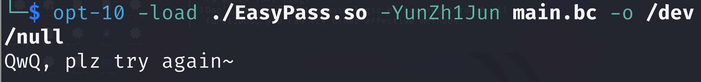
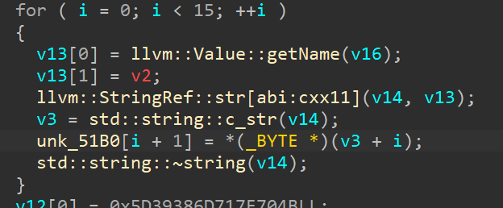
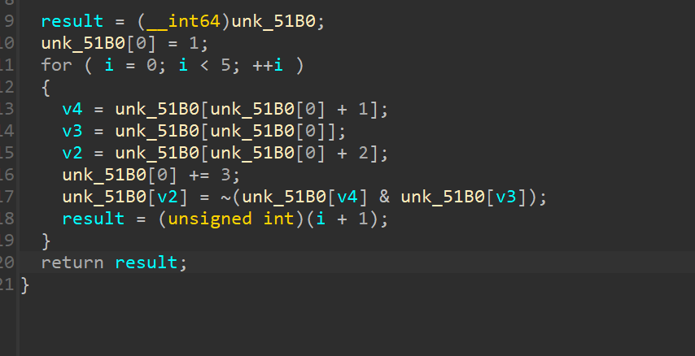
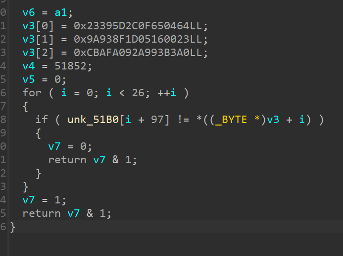
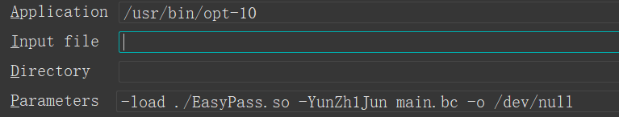

# Easy Pass wp by dr3

## 初步分析

解压附件没有可执行的文件，得到一个so

阅读README可知，这个so是一个LLVM Pass
所谓Pass，就是llvm在编译ir的时候对ir进行的操作，可以由用户
自行编写，进行自定义的操作

还有一个bc，即llvm的字节码。其实可以使用llvm-dis进行反编译
，可以直接回到ll，从而获取其中的变量

## 运行尝试

由于出题人的高超技巧，使得这个pass只能在非常稳（yuan）定（gu）
的llvm 10上面运行。然而，由于我的kali最旧最旧的版本也是13
而奇怪的是这个老版本压根就没法运行

反正我是不懂得，没办法，装呗

https://packages.ubuntu.com/focal/llvm-10

直接用这个装就行，带dpkg的都可以



## 静态分析

进入load函数，可以发现注册了一个pass

最后的pass传到了sub_2660

打开发现函数很大，没法直接反编译

函数的头部全是函数调用。但是仔细看可以发现每个函数都只做了
一件事，就是return了一个1

所以其实就是干扰的花指令，全部nop掉就可以

```python
for i in range(0x2673,0x6C9B):
    patch_byte(i,0x90)
```

之后就可以f5



首先是通过getName找到了16个string放到了数组里


之后进入一个函数对数组进行加密


最后从数组的最后几位进行对比

## getName

其实开始不知道得到了什么，不过好在配好了环境可以调试

虽然是llvm加载的so，但是配置好了输入的参数就可以直接进行调试
就像下面这张图一样

之后其实可以发现，
那个循环就是获得了函数的名称。

因此，加密之后应该是固定的。只需要把加密算法抠出来，之后
直接初始化flag，然后用z3跑一下就能出来了

还有一点就是提取数据的时候注意要小端序

以下是完整脚本

```python
from z3 import *

str0 = [0x01, 0x61, 0x61, 0x43, 0x43, 0x7A, 0x43, 0x7A, 0x7A, 0x4D,
        0x4D, 0x61, 0x4D, 0x43, 0x4D, 0x61, 0x00, 0x00, 0x00, 0x00,
        0x00, 0x00, 0x00, 0x00, 0x00, 0x00, 0x00, 0x00, 0x00, 0x00,
        0x00, 0x00, 0x00, 0x00, 0x00, 0x00, 0x00, 0x00, 0x00, 0x00,
        0x00, 0x00, 0x00, 0x00, 0x00, 0x00, 0x00, 0x00, 0x00, 0x00,
        0x00, 0x00, 0x00, 0x00, 0x00, 0x00, 0x00, 0x00, 0x00, 0x00,
        0x00, 0x00, 0x00, 0x00, 0x00, 0x00, 0x00, 0x00, 0x00, 0x00,
        0x00, 0x00, 0x00, 0x00, 0x00, 0x00, 0x00, 0x00, 0x00, 0x00,
        0x00, 0x00, 0x00, 0x00, 0x00, 0x00, 0x00, 0x00, 0x00, 0x00,
        0x00, 0x00, 0x00, 0x00, 0x00, 0xFF, 0x00, 0x79, 0x6F, 0x75,
        0x5F, 0x73, 0x68, 0x6F, 0x75, 0x6C, 0x64, 0x5F, 0x70, 0x61,
        0x74, 0x63, 0x68, 0x5F, 0x74, 0x68, 0x69, 0x73, 0x5F, 0x66,
        0x6C, 0x61, 0x67]

text1 = [BitVec(f"{i}", 8) for i in range(124 - 97)]
for i in range(97, 123):
    str0[i] = text1[i - 97]
str0[0] = 1
names = ["aaCCzCzzMMaMCMa",
         "bbMMyMyyZZbZMZb",
         "ccCCxCxxJJcJCJc",
         "ddQQwQwwMMdMQMd",
         "eeYYvYvvKKeKYKe",
         "ffHHuHuuCCfCHCf",
         "ggDDtDttKKgKDKg",
         "hhDDsDssOOhODOh",
         "iiCCrCrrIIiICIi",
         "jjOOqOqqDDjDODj",
         "kkSSpSppEEkESEk",
         "llXXoXooTTlTXTl",
         "mmLLnLnnVVmVLVm",
         "nnII_I__HHnHIHn",
         "ooOO_O__CCoCOCo",
         "ppFF_F__NNpNFNp",
         "qqDD_D__BBqBDBq",
         "rrTT_T__BBrBTBr",
         "ssJJ_J__CCsCJCs",
         "ttGG_G__XXtXGXt",
         "uuDD_D__OOuODOu",
         "vvUU_U__JJvJUJv",
         "wwOO_O__SSwSOSw",
         "xxRR_R__SSxSRSx",
         "yyEE_E__KKyKEKy",
         "zzJJ_J__TTzTJTz",
         ]
for str1 in names:
    for i in range(1, len(str1) + 1):
        str0[i] = ord(str1[i - 1])
    str0[0] = 1
    for i in range(0, 5):
        v4 = str0[str0[0] + 1]
        v3 = str0[str0[0]]
        v2 = str0[str0[0] + 2]
        str0[0] += 3
        str0[v2] = (~(str0[v4] & str0[v3])) & 0xff
s = Solver()
cipher = [0x64, 0x04, 0x65, 0x0F, 0x2C, 0x5D, 0x39, 0x23, 0x23, 0x00,
          0x16, 0x05, 0x1D, 0x8F, 0x93, 0x9A, 0xA0, 0xB3, 0x93, 0xA9,
          0x92, 0xA0, 0xAF, 0xCB, 0x8C, 0xCA]
for i in range(97, 123):
    s.add(cipher[i - 97] == str0[i])
print(s.check())
m = s.model()

for d in m.decls():
    print(f"{d.name()} = {m[d]}")

# final = {20: 109,
#          18: 108,
#          13: 112,
#          17: 76,
#          10: 115,
#          21: 95,
#          15: 101,
#          23: 52,
#          7: 79,
#          5: 48,
#          6: 111,
#          8: 111,
#          0: 81,
#          2: 81,
#          12: 109,
#          3: 95,
#          16: 95,
#          14: 108,
#          22: 80,
#          9: 95,
#          11: 105,
#          1: 119,
#          25: 53,
#          19: 86,
#          24: 115,
#          4: 115,
#          }

```

然后就可以了

QwQ_s0oOo_simple_LlVm_P4s5