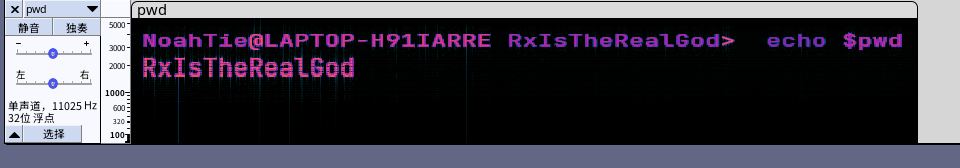
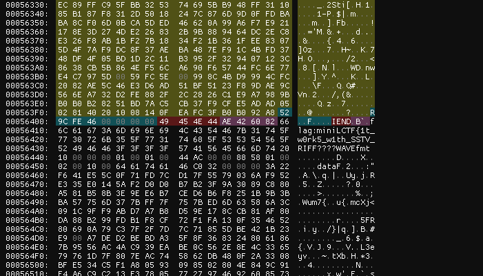
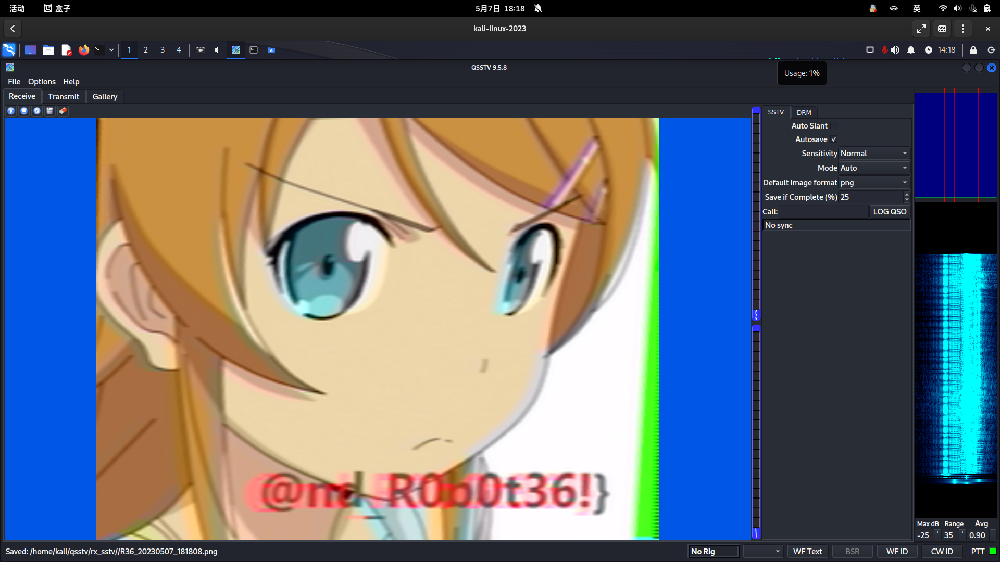
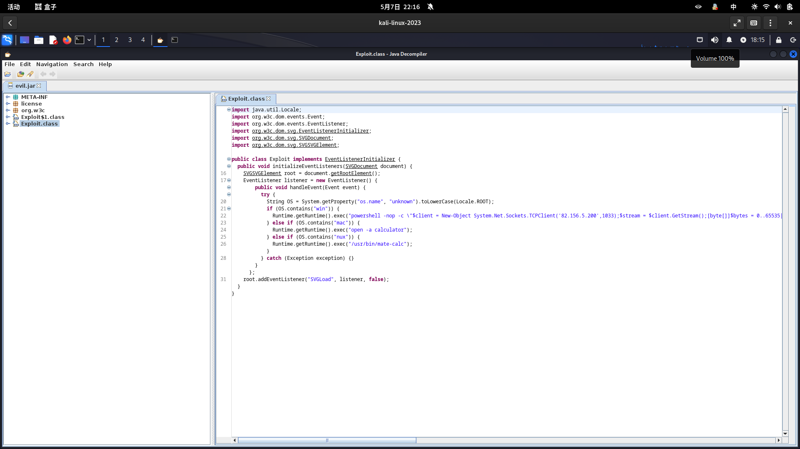
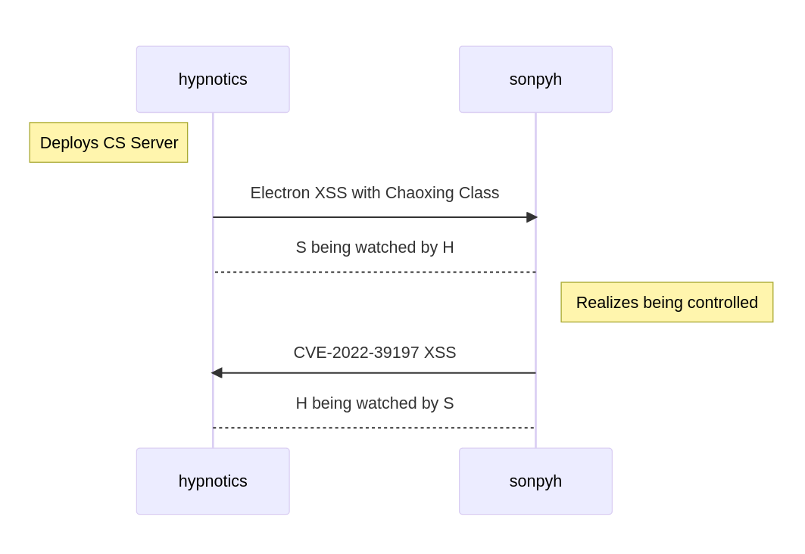

# mini L-CTF 2023 WriteUp by ZeroAurora

## 队伍介绍

- 队伍名：熬夜型rx直播切片委员会
- 队员：Koito Coco（队长）, Static, passers-by, ZeroAurora（我）
- 本人主攻：misc

## (picture_out_of_voice)^2

真正的签到题，本人抢到手刹，但是截至写作时已经掉到 500pts。

下载附件，解压得到 `pwd` 和 `flag.7z`。系统识别 pwd 是 WAV 音频文件，结合题目名，打开 Audacity 查看频谱图，得到 `flag.7z` 密码。



解压出来是个 `left.png`，大小高达 3m 有余，但是 `foremost` 产生的完全相同的图片仅有数百 kb。考虑夹杂其他文件，但是 `binwalk` 和 `foremost` 均无法解出。打开 hex 编辑器查看之，发现该文件实际由一个 PNG、一段 flag 文字（`flag:miniLCTF{1t_w0rk5_w1th_SSTV_`）和一个 WAV 音频组成。



手动提取 WAV，保存为 `right.wav`，根据 Flag 左半部分提示，播放并使用 QSSTV 解码，得到包含 Flag 右半部分的图片。



得到 Flag：`miniLCTF{1t_w0rk5_w1th_SSTV_@nd_R0b0t36!}`

顺便一提，Flag 中的 Robot36 是这段 SSTV 的编码格式。


## Evase64

虚假的签到题。谁家签到和奶茶是同义词啊？

不难理解题目要求一个 Base64 解码按小端序转 int 结果和 eval 结果全等的字符串。特别注意的是 `eval` 过程中禁止了方法或函数的调用。

群内消息提示最短 payload 是六个字符。于是和 Koito Coco 讨论尝试爆破，起初思维限制在符合 Base64 规则的数学表达式上，爆破未果。

后来 Koito Coco 发现默认情况下 `base64.b64decode` 方法并不要求提供的 ASCII 字符串符合 Base64 规则（不符合字符的会被自动忽略），于是从爆破转向利用这一缺陷。

后来本人提出 `False == 0` 的想法，并且根据这个想法发现了 payload：`"AA"==""`。这个字符串使用 `base64.b64decode` 方法解码得到 `0`，而 eval 结果为 `False`。经提交验证成功，得到 Flag。

后来我们又根据这个想法发现了好几个六字符的 payload。都到这里了相信大家也都能想出来，留作练习（不）。

## Android in Tunnel

先看 logcat (AndroidLogcatMain.pcapng)。

在 logcat 中频繁出现了一个包名：`com.genymobile.gnirehtet`。非常巧合的是，我之前因为手机基带硬件烧毁，正好用过一段时间的这个东西。

[Gnirehtet](https://github.com/Genymobile/gnirehtet) 是一个能够让手机使用电脑的互联网连接的工具。其原理是向手机推送一个非常迷你的本地 VPN 应用并安装，这个应用启动之后会自动设置 VPN，将 VPN 流量全部转发到电脑的 server，再由 server 转发出去。

（如果熟悉这个 repo 的 org 名：没错，大名鼎鼎的 scrcpy 也是这个名为 Genymobile 的公司的员工的作品。）

出题人如果考别的协议那也太变态了。当然也是因为看到前台应用切换到了 Microsoft Edge (No. 1235 @ AndroidLogcatMain.pcapng)，于是便翻 USB 流量包 (USBPcap3.pcapng) 找 Plain HTTP 流量。先用 Wireshark 过滤出包内容含 HTTP 字样的包，再清除过滤器看相邻的包。因为有太多的小杂包，所以不妨用过滤器过滤出大于 100b 的包。

很快就找到了 No. 135：

```
GET /getpwd.html HTTP/1.1
Host: 124.222.21.16:8080
Connection: keep-alive
[...]
```

于是接着往下看 (No. 159)：

```
HTTP/1.1 200 OK
Date: Fri, 31 Mar 2023 05:34:57 GMT
[...]
```

和再往下相邻的几个包共同组成了一整个 HTTP 回复。其中的两行非常瞩目：

```html
<p>Link: <a href="https://pastebin.com/r1zKVLP5">https://pastebin.com/r1zKVLP5</a></p>
<p>PWD: 8uma8yF03G</p>
```

打开看看：

```
Market Item: Rare Photo of Rx (plus a free flag)
Password: f9b7535d9df327f9474b64d233db9143
```

好嘛，Rx 帅照，这下不得不接着做了。

有密码了总得有个东西让我解密吧？Logcat 没信息了，只能在流量包翻啊翻，怎么看到不少 ls 输出，这人怎么好像在 shell 里面翻东西的样子？好像是进了 QQ 的附件下载文件夹，翻到最后看到一个 zip 文件名 (No. 8319)：

```
/sdcard/Android/data/com.tencent.mobileqq/Tencent/QQfile_recv/Photos.zip
```

好嘛，来了。但是一看接下来的几个大包：怎么只有 PK 头没有 PK 尾啊？

然后我就自我怀疑了一个晚上。正好当晚因为一些事情很抑郁，Rx 也和我说这次问出题人题目的人太多了，校赛的意义完全丧失了，于是我也就完全失去了询问出题人的想法。

第二天中午还是忍不住问了出题人，结果出题人说自己不小心传错附件了，这里的几个包（因为我也不知道的原因）被设备加密了，于是做不出来。

于是 Flag 就变成了上面的密码，`miniLCTF{f9b7535d9df327f9474b64d233db9143}`。

啊。还好。

## Counterstrike

一道干扰巨多、信息量巨大的题目。踩了很多坑，绕了很多路，写 wp 的时候按照整理后的顺序写，并且省略了很多本人的 nt 操作，实际上这道题折腾了我一整天。

### Flag 1

题目给的两个包都以 TCP 流量为主。首先从 `victim.pcapng` 开始看。流量特别多特别杂，直到看到 No. 828：`GET /miniL1.html`。

查看返回的 HTML 不难发现，这是一个由于使用 Electron 的某开发者没做好基本安全措施而导致的 RCE。结合同包的上文，很难不怀疑这是超星电脑端的锅。

同包中有另一段 script，可以看出是一段混淆的 JS，直接执行会报错。将 eval 中的匿名函数拆出来单独执行，返回一段 JS，格式化后展示如下：

```javascript
function xorEncrypt(a, b) {
  let result = "";
  for (let i = 0; i < a.length; i++) {
    const charCode = a.charCodeAt(i) ^ b.charCodeAt(i % b.length);
    result += String.fromCharCode(charCode);
  }
  return btoa(result);
}

let flag = "REMOVED_BY_HACKER_HAHAHAHA_TRY_DECRYPT_IT";
console.log(xorEncrypt(flag, "SECRET_KEY_balabalabala"));
console.log(
  "Encrypted Message:PiwtOwkXCw0+DHsHPi8OICEAFTEVHigYdhwlDCAXFAYYKjYoXC89"
);
```

是个异或，稍微改改：

```javascript
function xorDecrypt(a, b) {
  a = atob(a);
  let result = "";
  for (let i = 0; i < a.length; i++) {
    const charCode = a.charCodeAt(i) ^ b.charCodeAt(i % b.length);
    result += String.fromCharCode(charCode);
  }
  return result;
}

let flag = "PiwtOwkXCw0+DHsHPi8OICEAFTEVHigYdhwlDCAXFAYYKjYoXC89";
console.log(xorDecrypt(flag, "SECRET_KEY_balabalabala"));
```

我还以为我要找 Secret Key 的，没想到就直接给我出了。至此找到 Flag 1：`miniLCTF{U$e_CoB@ltStrIK3_wItH_CAuTI0N_`。Flag 1 提示了 Cobalt Strike，这是一个用于红队的测试渗透工具。我们下文会提到。

### 梳理思路

从 `/miniL1.html` 追踪到 `/miniL2.html`，发现开始动 Powershell 了，几层 Base64 解下来，发现已经开始动 shellcode 了，后续就是向服务器 HTTP 提交一些不知所云的 payload 了。对这边的追踪只能就此作罢。

观察另一个包 `victim's server.pcap`。一上来就是个 `evil.svg`，然后就是从 `evil.svg` 里加载 `EvilJar-1.0-jar-with-dependencies.jar`。不是，这都什么年代了还在浏览器用 Java 啊？然后看到 `evil.svg` 里包含了一串文字：`CVE-2022-39197`。

Cobalt Strike 是 C/S 架构，红队搭建一个共用服务器，队员使用客户端连接并操作服务器，服务器与植入受控机的 beacon 进行通信。客户端使用 SWING 作为 GUI 框架，而当时 SWING 的 HTML 代码动态加载并没有严格地被限制。而 `CVE-2022-39197` 的原理，就是通过伪造受控机上线，利用 beacon 的漏洞返回一个格式错误的用户名，进而执行 XSS 反制攻击者。

事已至此，先逆 JAR 吧。



这个 JAR 在其他系统都只是弹计算器，在 Windows 上就通过 1033 端口做坏事了。于是在 `victim's server.pcap` 中过滤 1033 端口的 TCP 包，容易看到这个机器的 cmd 已经被监控了。

当然，一番查找，我们也很容易看出两个机器的用户名：`victim` 的用户是题干所述的 sonpyh，而 `victim's server` 的用户是 hypnotics。于是这两个人在干什么就很清楚了：



这也就呼应了题目的简介。另外顺便一提，梳理完这两人的关系之后，我觉得题目给的两个文件名并不是很准确：同一个词 victim 被用来指代两个不同的人。不过也随便啦。

## Flag 2

梳理清楚之后，就要考虑从哪里拿 Flag 了。

hypnotics 被监视的流量包中有一个用 `certutil.exe` Base64 过的文件：`.cobaltstrike.beacon_keys`，不管怎么说先导出来解码保存。需要注意的是 certutil 会自动向文件头尾加证书头尾，以至于我一度以为这是证书文件浪费了好久。

除此之外，hypnotics 一侧就没什么好看的了。于是目光转向 sonpyh 一侧，考虑分析那几个 payload。

搜索相关资料，找到了一系列来自 [NVISO Lab](https://www.nviso.eu) 的 [Cobalt Strike 流量分析专栏文章](https://blog.nviso.eu/series/cobalt-strike-decrypting-traffic/)，以及文章作者 [Didier Stevens](https://blog.didierstevens.com/about/) 为文章配套的 [一系列工具](https://blog.didierstevens.com/programs/cobalt-strike-tools/)。我们实际要用到的只有其中的两个：`cs-decrypt-metadata` 和 `cs-parse-traffic`。

Cobalt Strike 的 beacon metadata 藏在 Cookie 中，而 Cookie 则藏在向伪造的 `/IE9CompatViewList.xml` 的请求中。使用 `cs-decrypt-metadata` 工具，利用先前的 `.cobaltstrike.beacon_keys` 对其进行解密，就能找到加密 payload 的密钥：

```
$ python ./cs-decrypt-metadata.py -f .cobaltstrike.beacon_keys (cat metadata_cookie)
Input: E/GLBY8y0zSYzQryoyZzZ1Z7f0wFbcleeaBHG73+8SzCmhAe4BYLMP/kbM9Y13Y1S13yXWMH9IFNnTp52QJyXKL2eAdKeHyQA/qcP0lX7RL6pkT4GVdRfrMRXtaAPNUyPDUj5LZ+fRd5p1KQDQoQ0Ik8dYtSV7kDl26C/e1/C+E=
[...]
Decrypted:
Header: 0000beef
Datasize: 00000058
Raw key:  abd65d240026ab1d8f0a0eca97f2e710
 aeskey:  25465e54b77dd74ef43712494d3fcaa0
 hmackey: 8032472a398493c6bb29c08a1e54eac6
[...]
```

（P.S. 其实整个流量包中有两个 metadata cookie，我们只需要第一个，也就是 `GET /IE9CompatViewList.xml` 中的来解题。`GET /j.ad` 的 cookie 只能解最后一个 payload，对解题没有作用。）

然后，我们便可使用 `cs-parse-traffic` 和密钥直接解析流量包中的 payload：

```
$ python cs-parse-traffic.py -r abd65d240026ab1d8f0a0eca97f2e710 ./victim.pcapng -Y "http and ip.addr==101.42.254.207" > traffic1.txt
```

查看解析结果，`flag.zip` 在包 No. 1924 的 dir 回显中出现了。No. 1969 中有对文件的操作，从这里把文件提取出来：

```
$ python cs-parse-traffic.py -r abd65d240026ab1d8f0a0eca97f2e710 ./victim.pcapng -Y "frame.number==1969" -e
```

可是 zip 有密码啊！顺着之前的解析接着往下看可以看到一系列的 keystroke callback。说实在话我真不觉得这是键盘的输入事件，因为当你使用 GBK 解码的时候你甚至能看到“输入密码”字样……

```
b'!\x00\x00\x00\n\n\x03C\xca\xe4\xc8\xeb\xc3\xdc\xc2\xeb\n\x03E=======\x0f\ne83e449b-\x01\x00\x00\x00\x08\x00\x00\x00\xca\xe4\xc8\xeb\xc3\xdc\xc2\xeb\x06\x00\x00\x00sonpyh'
b'\x0b\x00\x00\x002454-4093-b\x01\x00\x00\x00\x08\x00\x00\x00\xca\xe4\xc8\xeb\xc3\xdc\xc2\xeb\x06\x00\x00\x00sonpyh'
b'\t\x00\x00\x0050b-38b04\x01\x00\x00\x00\x08\x00\x00\x00\xca\xe4\xc8\xeb\xc3\xdc\xc2\xeb\x06\x00\x00\x00sonpyh'
b'\x07\x00\x00\x00883e82b\x01\x00\x00\x00\x04\x00\x00\x00flag\x06\x00\x00\x00sonpyh'

# GBK 解码第一行 be like:
'!\x00\x00\x00\n\n\x03C输入密码\n\x03E=======\x0f\ne83e449b-\x01\x00\x00\x00\x08\x00\x00\x00输入密码\x06\x00\x00\x00sonpyh'
```

但总之，从这几个 keystroke callback 中，可以找出零散在各处的一串的 UUID：`e83e449b-2454-4093-b50b-38b04883e82b`。

用这个作为密码，解压。成功得到 Flag 2：`oR_6Et_pwNEd_1n_r3veRs3}`

于是 Flag：`miniLCTF{U$e_CoB@ltStrIK3_wItH_CAuTI0N_oR_6Et_pwNEd_1n_r3veRs3}`

## 后记

pycalculator 一题的 WriteUp 由 Koito Coco 撰写，我就不写了。

我本来应该在这里写点什么感想的，但是想了想，WriteUp 还是集中精力分析技术比较好。

总之，感谢“熬夜型rx直播切片委员会”的各位。

另外感谢 Rx 本人能在深夜陪我瞎 bb。
